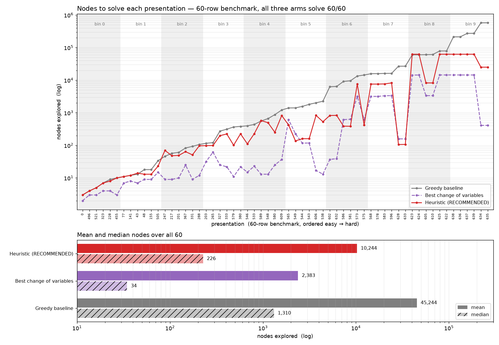

# Heap ordering for the greedy substitution search

[`greedy_baseline.py`](greedy_baseline.py) is a best-first search: pop the most promising open state, apply every Definition 2.1 substitution move, reduce, canonicalise, push what is new. The baseline picks "most promising" by **total length**. [`heuristics.py`](heuristics.py) replaces that expression and nothing else.

## The ordering

```
priority(r1, r2) = L + 2.53·K + 6.418·MK + 8.458·S + 3.292·xyimb
```

`RECOMMENDED` in full: five of seventeen features, one weight vector, no length boundary. Lower pops first, so each term pushes a state down the queue — preferred for being short (`L`), less tangled (`K`, `MK`), thicker runs of the thinner generator (`S`), even use of both generators (`xyimb`). Tuned jointly: `S` is the weakest of the five alone and carries the largest weight here, so one-at-a-time tuning would have dropped it.

`BASELINE_CONFIG` is the control — `{"L": 1.0}`, plain total length, reproduces `greedy_search` exactly.

## Using it

```python
from experiments.search.heuristics import greedy_search_h, RECOMMENDED

stats = greedy_search_h(r1, r2, node_budget=100_000, max_relator_length=24,
                        config=RECOMMENDED)     # config=None  =>  the baseline, exactly
```

Returns `greedy_search`'s eleven-key dict — same keys, order, types — so a call site switches ordering with one argument. `phi(r1, r2)` gives the feature vector; `make_priority(config)` compiles a config into the heap's key function.

## Results — 60-row benchmark

Six presentations per difficulty bin. Data: [`benchmark_subset_60_arms.csv`](../../benchmark/subsets/benchmark_subset_60_arms.csv), which every number below computes from.



Best known cost per presentation:

| arm | solved | median nodes | mean nodes | median path | mean path |
|---|---|---|---|---|---|
| greedy baseline | 60/60 | 1,310.5 | 45,244.2 | 46.5 | 142.62 |
| best change of variables | 60/60 | 34.5 | 2,383.1 | 16.5 | 97.05 |
| **`RECOMMENDED`** | 60/60 | **226.5** | **10,244.0** | **38.0** | **102.73** |

Both transformed arms are cheaper *and* return shorter derivations. Read the median — the greedy's mean is a 35× skew off a few second-hump rows.

Two caveats. The columns ran at **different budgets and caps** (10⁶/24, ≤20k/24, 100k/48), so a cross-column ratio is not a controlled speedup. And best CoV is an **oracle**: 2,383 is what the winning `z` costs once you know which `z` wins, and finding it cost ~2.2M nodes per presentation. The heuristic is one search, one fixed ordering. The CSV's `m10k_*` columns hold all three at a matched 10,000/cap 24.

## What CI runs

The 20-row subset at budget 1,000 — baseline **10/20**, `RECOMMENDED` **15/20**, nothing traded away. Those ids are `benchmark/subsets/benchmark_subset_20.json` verbatim, in file order; that file is not in this repo, so they are inlined in [`test_greedy_heuristic.py`](../../tests/test_greedy_heuristic.py) with their provenance.

A **regression pin, not held-out validation**: 14 of the 20 are in the slice these weights were tuned on. On the 4 held out, baseline 1, `RECOMMENDED` 3.

## The features

A relator is a **cyclic** word. Its **blocks** are the maximal runs of one generator read around the ring, where a letter and its inverse are the same generator (`xXxX` is one block of four). A run wrapping the seam is one block, not two — counting it twice would read where the canonicaliser cut the word instead of the presentation.

`phi(r1, r2)` computes all seventeen in one pass, cached; every one is rotation-invariant. **Bold** = used by `RECOMMENDED`.

| # | name | what it measures | why it might help |
|---|---|---|---|
| 0 | **`L`** | total length, `len(r1) + len(r2)` | the baseline's entire ordering; the trivial state is the shortest, so length is the obvious distance-to-go proxy |
| 1 | `Lmin` | length of the shorter relator | the trivial state needs *both* at length 1; a short one is half the job done |
| 2 | `Lmax` | length of the longer relator | what still has to come down; `L` cannot tell `12+12` from `2+22` |
| 3 | `imbal` | `Lmax - Lmin` | a lopsided pair has one relator doing all the work |
| 4 | **`K`** | knot sum, `knots(r1) + knots(r2)` | knot reduction is rare and hard, so a state that bought one should outrank one that merely got shorter |
| 5 | **`MK`** | max knots over the two relators | a pair is only as reducible as its harder half |
| 6 | `mK` | min knots | nonzero means *both* relators are mixed words — no pure power to work with |
| 7 | **`S`** | smaller mean block: mean run length of the thinner generator | thin runs are where cancellation can start |
| 8 | `Bmax` | larger mean block | long uniform runs are a different shape from fine alternation |
| 9 | `B1` | number of length-1 blocks | isolated letters — where a substitution can cancel a whole block |
| 10 | `Bmin` | shortest block in the pair | the most fragile spot; `B1` counts them, this says whether any exists |
| 11 | `nb` | total blocks across both relators | how chopped-up the pair is, unnormalised |
| 12 | **`xyimb`** | `abs(#x − #y) / L` | generator imbalance, scale-free: leaning on one generator is closer to a pure power |
| 13 | `Bmaxrun` | longest single block | `Bmax` is a *mean* and hides a spike; this sees it |
| 14 | `Bspread` | longest − shortest block | how uneven the blocking is; a uniform and a spiky pair share every mean above |
| 15 | `ratio` | `Lmin / Lmax` | imbalance as a ratio — ranks differently from `imbal` at different scales |
| 16 | `density` | `nb / L` | blocks per letter: how finely the pair alternates, scale-free |

Knots are `0` for a **pure power** (one generator absent) — nothing to be tangled with. Otherwise `max(#x-blocks, #y-blocks)`.

## Config shape

`{"segments": [{"upto": <ceiling>, "w": {feature: weight}}, ...]}`. Segments are tried in order; the first whose `upto` covers the state's total length wins, and the last should carry `"upto": None`. Both configs here use one segment — multi-segment configs switch weights at a length boundary, and the schema keeps that open because the research harness speaks the same format.

The heap key is `(segment_index, score)`. The leading index makes every state below a boundary outrank every state above it, and stops two segments' scores — on unrelated scales — from being compared.

## Two invariants

**The control gate.** `config=None` must reproduce `greedy_search` *pop for pop* — same `solved` flag **and** same `nodes_explored`. Scoring the same is not being the same: a changed reduction, cap or tie-break could still tie on a benchmark, and every reported delta would then measure that change instead of the ordering. It also keeps the baseline inside the config space — a space that cannot express "no change" always appears to beat its control.

**The priority must be a pure function of the state.** The visited set dedups on first discovery and there is no decrease-key, so a state's priority is fixed by whichever path reached it first. Any term reading `depth` or the parent ("did this move drop a knot?") would make pop order depend on discovery order. A knot *reduction* is already carried by the **absolute** knot count.
