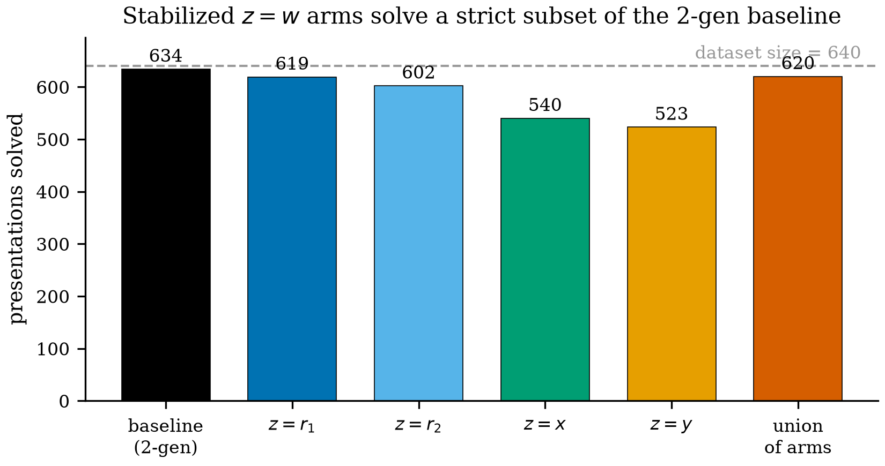
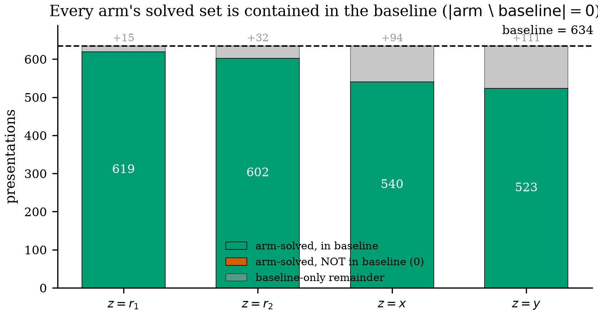
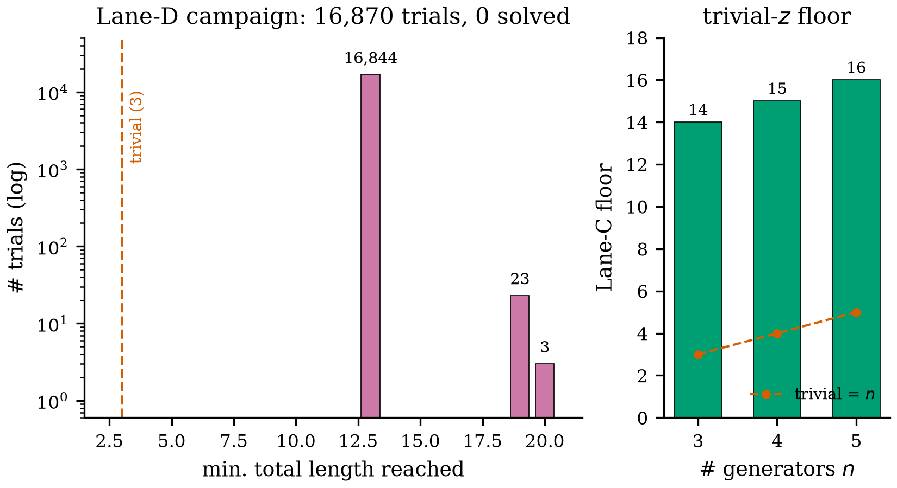
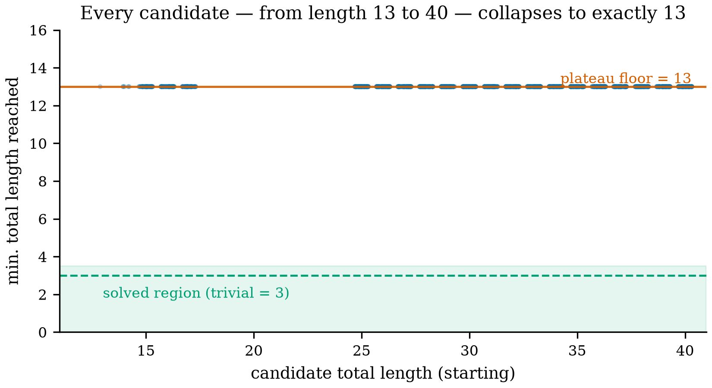
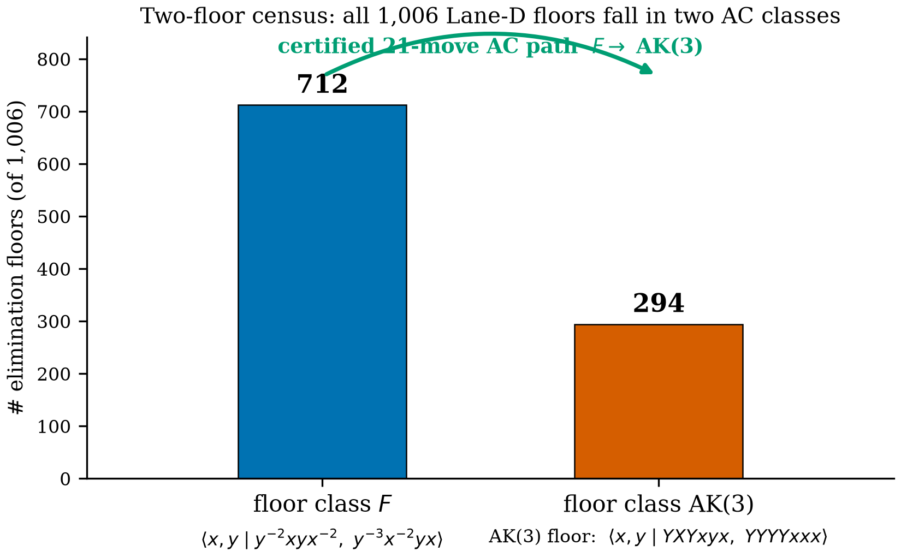
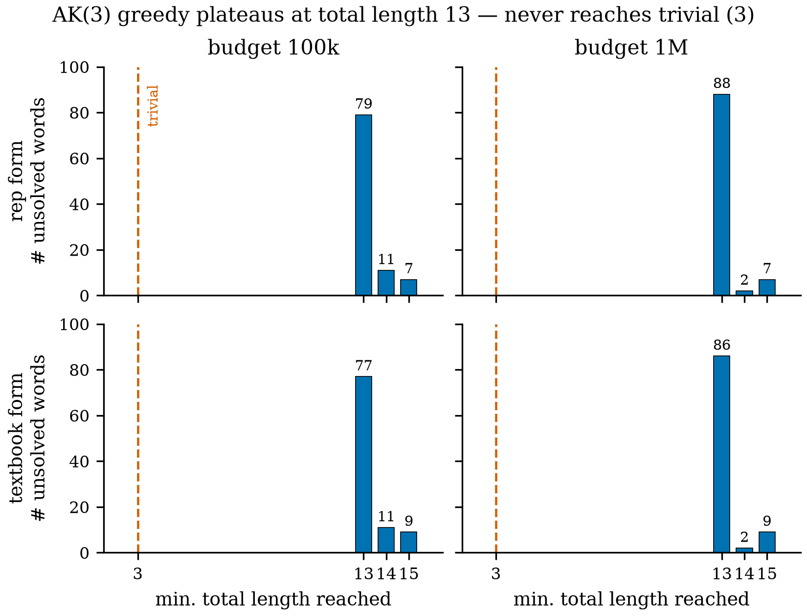
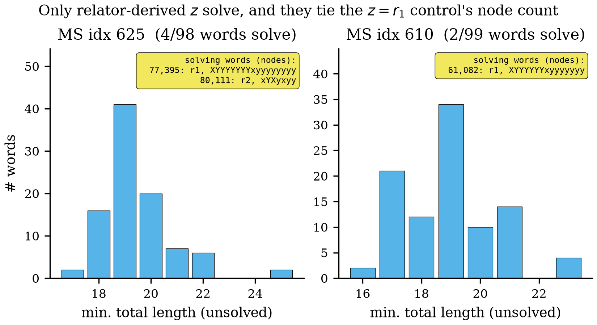
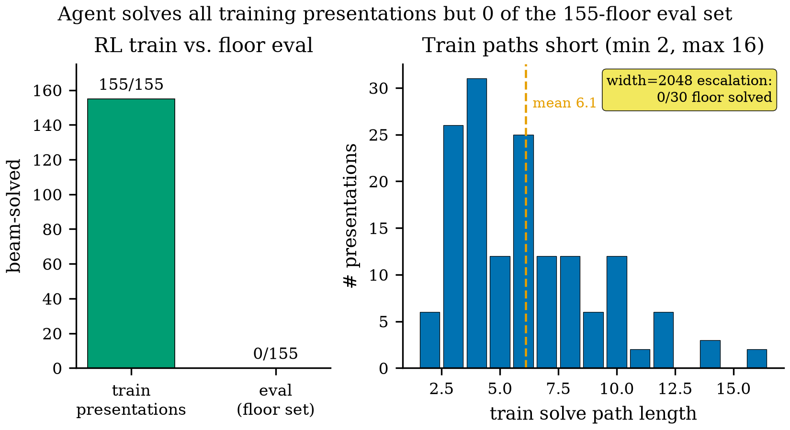

# The Hump, Not the Cap: A Negative-Result Audit and a Structural Floor for the Stable Andrews–Curtis Conjecture on AK(3)

*Anonymous submission (NeurIPS review mode).*

## Abstract

The Andrews–Curtis (AC) conjecture asserts that every balanced presentation of the trivial group reduces to the trivial presentation by elementary moves; its stable variant additionally permits stabilization by a generator. The Akbulut–Kirby presentation $\mathrm{AK}(3) = \langle x,y \mid x^{3}=y^{4},\ xyx=yxy\rangle$ has stood as the shortest well-known potential counterexample since 1985. A 2024 claim that $\mathrm{AK}(3)$ is stably AC-trivial was rescinded in a later revision after a misprint was found in the underlying construction, and a second, independently authored paper inherits the same rescinded premise. We re-verify computationally that the stable status of $\mathrm{AK}(3)$ is open again (7 of 7 independent checks agree; two data defects found in a published trivialization artifact), while confirming that the plain-AC equivalence $\mathrm{AK}(3)\sim\mathrm{P}25$ survives via a certified 53-move replay. We then audit whether stabilization opens shortcuts unreachable by 2-generator search. Three strategies — a naive $z=w$ construction over 640 Miller–Schupp presentations, a 97-word literature-grounded bank on $\mathrm{AK}(3)$, and a five-lane campaign mining 180,645 distinct 2-generator quotients — record 0 of 16,870 solve attempts succeeding, within the searched budgets (up to $2\times10^{6}$ nodes per search, beam width $\le 2048$). We further show the $L=24$ length cap is not the binding constraint in the tested range ($L\le 48$). Structurally, the length-13 floor of $\mathrm{AK}(3)$'s AC-class has exactly two canonical (signed-relabel) representatives, joined by a certified 21-move AC path. Every finding ships as a machine-checkable certificate (20,947 checks, two independent verifiers, 0 failures). A rigorously verified negative, plus a structural map of where stabilized search stalls, gives the community a firm floor rather than a claimed summit.

## 1 Introduction

The Andrews–Curtis (AC) conjecture [2] states that every *balanced* presentation of the trivial group — a presentation $\langle x_1,\dots,x_n \mid r_1,\dots,r_n\rangle$ with as many relators as generators that presents the one-element group — can be transformed into the trivial presentation $\langle x_1,\dots,x_n \mid x_1,\dots,x_n\rangle$ by a finite sequence of elementary moves. Sixty years after it was posed, it remains open, and its difficulty is not merely combinatorial folklore: a balanced presentation that resisted trivialization would refute the conjecture, and the same balanced presentations sit at the heart of low-dimensional topology, where they encode handle decompositions of contractible $4$-manifolds. Potential AC counterexamples arise directly from Akbulut–Kirby's smooth $4$-dimensional constructions [1] and from candidate counterexamples to the Property $2R$ and slice–ribbon conjectures [7], and the conjecture is explicitly entangled with the smooth $4$-dimensional Poincaré problem [6]. Among all candidates, the Akbulut–Kirby presentation $\mathrm{AK}(3) = \langle x,y \mid x^{3}=y^{4},\ xyx=yxy\rangle$ is the shortest and most-studied potential counterexample, standing since 1985.

The *stable* (or *weak*) AC conjecture relaxes the problem by allowing two further moves, stabilization by a trivial generator–relator pair (AC4) and its inverse (AC5); a presentation reducible to the trivial one under AC1–AC5 is *stably AC-trivial*. The stable status of $\mathrm{AK}(3)$ has recently oscillated. The first version of a 2024 case study [17] announced that $\mathrm{AK}(3)$ is stably AC-trivial, removing it as a stable-AC counterexample; a subsequent revision located a misprint in the Wirtinger construction of [16] on which that argument depended and rescinded the claim. A parallel automated-deduction paper [13], written between those two versions, builds its stable-triviality conclusion on the same, now-rescinded premise and has not been revised. The plain reading of the current literature is therefore blunt: the stable AC-triviality of $\mathrm{AK}(3)$ is open again.

Search-based and learning-based methods have crossed hard barriers in this domain before — genetic algorithms trivialized $\mathrm{AK}(2)$ [14], and a recent study of the AC difficulty landscape [5] pushed reinforcement learning past presentations that classical search cannot reach. This invites a concrete question about stabilization as an escape hatch: does adding a generator $z$ defined by a relator $z^{-1}w(x,y)$ — for a cleverly chosen word $w$ in the original generators — open shortcuts (informally, "wormholes") through the enlarged AC graph that ordinary 2-generator search cannot find? If some $w$ trivialized $\mathrm{AK}(3)$ where the dumb choices $z=r_i$ do not, stabilization would be a genuine algorithmic lever rather than bookkeeping.

This paper is a systematic audit of that hope, and it returns a rigorously verified negative paired with a structural map (Figure 1). We first re-verify, seven independent ways, that the stable status of $\mathrm{AK}(3)$ is open while its plain-AC equivalence to the length-25 presentation P25 survives. We then run three stabilization strategies of increasing sophistication — all of which fail within the searched budgets — and a control showing that the per-relator length cap is not what stops them. Finally, we characterize *where* stabilized greedy search stalls: a length-13 floor whose AC-class has exactly two canonical representatives, bridged by a certified move sequence. Throughout, every positive claim is emitted as a machine-checkable certificate.

_(Schematic — see Figure 1 in the compiled PDF.)_

**Figure 1.** End-to-end audit pipeline: a greedy substitution solver, a stabilization move that defines a fresh generator $z$ by a chosen word $w(x,y)$, a 97-word literature-grounded bank, and five attack lanes (meet-in-the-middle, direct stable-move search, trivial-$z$ control, plateau elimination, and a zero-shot RL beam probe), with every reported solution emitted as a machine-checkable certificate replayed by two independent verifiers.

**Contributions.**

- **Re-verification of a re-opened question.** We computationally confirm, via 7 of 7 agreeing independent checks (Smith normal form, Todd–Coxeter coset enumeration, and $S_3$-homomorphism counting among them), that $\mathrm{AK}(3)$'s stable status is open, that the plain-AC link $\mathrm{AK}(3)\sim\mathrm{P}25$ survives (53-move replay, plus validation of an independent Prover9 derivation), and we surface two data defects in a published trivialization artifact.
- **Systematic stabilization negatives at stated budgets.** Across a naive $z=w$ construction over 640 Miller–Schupp presentations, a 97-word literature-grounded bank on $\mathrm{AK}(3)$, and a five-lane campaign that mines 180,645 distinct 2-generator quotients, 0 of 16,870 solve attempts succeed within the searched budgets (up to $2\times10^{6}$ nodes per search, beam width $\le 2048$).
- **A cap-not-binding control.** We show the $L=24$ per-relator length cap is not the binding constraint in the tested range: relaxing to $L\le 48$ (and total length $\le 60$) does not convert a single failure into a success.
- **A two-representative structural floor.** The length-13 floor of $\mathrm{AK}(3)$'s AC-class has exactly two canonical (signed-relabel) representatives — $F=\langle x,y \mid y^{-2}xyx^{-2},\ y^{-3}x^{-2}yx\rangle$, a $2$-generator presentation AC-equivalent to $\mathrm{AK}(3)$ (712/1006 $=71\%$ of floor states), and $\mathrm{AK}(3)$'s own reduced form (294/1006 $=29\%$) — joined by a certified 21-move AC path.
- **A certificate framework and reusable archive.** We release the acx-cert-v1 machine-checkable certificate format with two independently authored verifiers (20,947 checks, 0 failures) and the full candidate-quotient archive, so every claim above is independently re-runnable.

Code, data, and all certificates will be released on acceptance.

## 2 Background and Related Work

### 2.1 AC moves, substitution, and stable AC

A *balanced presentation* $\langle x_1,\dots,x_n \mid r_1,\dots,r_n\rangle$ has equally many generators and relators, each relator a word in the $x_i^{\pm 1}$; throughout we write words with $x^{-1}yx$ notation and use the shorthand $X=x^{-1}$, $Y=y^{-1}$ where it aids readability. The elementary Andrews–Curtis moves act on the ordered tuple of relators: (AC1) replace some $r_i$ by $r_i^{-1}$; (AC2) replace some $r_i$ by $r_i r_j$ with $j\neq i$; (AC3) replace some $r_i$ by $w\, r_i\, w^{-1}$ for an arbitrary word $w$. Two presentations related by a finite sequence of AC1–AC3 are *AC-equivalent*, and a presentation AC-equivalent to the trivial one is *AC-trivial*. Because the elementary moves take small steps, effective search operates on *substitution supermoves* that package AC2 and AC3 into a single action: viewing both relators as cyclic strings, a substitution rotates each and splices one into the other so that at least one pair of letters cancels [5]. Substitutions enlarge the action space but shrink the effective state space, and they are the move set our search inherits.

The *stable* (or *weak*) AC conjecture adds two moves [17]: (AC4) introduce a fresh generator together with the trivial relator equal to it, replacing $\langle x_1,\dots,x_n \mid r_1,\dots,r_n\rangle$ by $\langle x_1,\dots,x_n,x_{n+1} \mid r_1,\dots,r_n,x_{n+1}\rangle$; and (AC5), its inverse, deleting a generator and its trivial relator. Presentations related by AC1–AC5 are *stably AC-equivalent*, and the stable conjecture asserts every balanced presentation is stably AC-trivial. Stabilization is exactly the freedom our audit probes, and its most useful consequence here is Lemma 11 of [17] (substitution-and-removal): given a trivial-group presentation $\langle x_1,\dots,x_n,y \mid r_1,\dots,r_n,\ y^{-1}w\rangle$ in which $w$ is a word in the $x_i$ *only*, the $n$-generator presentation $\langle x_1,\dots,x_n \mid r_1',\dots,r_n'\rangle$ obtained by substituting $w$ for every occurrence of $y$ is stably AC-equivalent to it. The proof exhibits $w$ as a product of conjugates of the $r_i'$, but places no bound on how many such factors are needed, so the packaged supermove has no *a priori* length bound (full statement in Appendix A).

### 2.2 The AK$(n)$ and Miller–Schupp families

The Akbulut–Kirby series $\mathrm{AK}(n)=\langle x,y \mid x^{n}=y^{n+1},\ xyx=yxy\rangle$ arose from smooth $4$-manifold topology [1]; $\mathrm{AK}(2)$ is AC-trivial, while every $\mathrm{AK}(n)$ with $n>2$ is an open case, $\mathrm{AK}(3)$ being the shortest. The Miller–Schupp series $\mathrm{MS}(n,w)=\langle x,y \mid x^{-1}y^{n}x=y^{n+1},\ x=w\rangle$, parameterized by $n\ge 1$ and a word $w$ of exponent sum $0$ in $x$, is a second two-parameter family of balanced trivial-group presentations [15], and it supplies the 1190-presentation benchmark our sweeps use. These families are linked: $\mathrm{AK}(n)$ is AC-equivalent to $\mathrm{MS}(n,w_1)$ with $w_1=y^{-1}x^{-1}yxy$ (Proposition 5 of [17]). Two further results ground our word bank. The isolation family $w_k=y^{-k}x^{-1}yxy$ threads a one-parameter path of AC-equivalent presentations through $\mathrm{MS}(n,w_k)$ for all $k\in\mathbb{Z}$ (Theorems 6 and 7 of [17]), and the distinguished word $w_\star=y^{-1}xyx^{-1}$ makes $\mathrm{MS}(n,w_\star)$ AC-trivial for every $n$ (Theorem 3). Each identifies structurally motivated words $w$ worth throwing at stabilized $\mathrm{AK}(3)$.

### 2.3 The misprint that re-opened the question

The stable-triviality argument for $\mathrm{AK}(3)$ traces back to Theorem 1.4 of [16] (MMS02), which builds a $3$-generator family of trivial-group presentations by deleting one redundant relator from a Wirtinger presentation of an unknot diagram and adjoining a trivializing relator. As printed, the $13$th Wirtinger relator reads $x_{13}=x_5 x_{12} x_5^{-1}$, whereas the diagram requires $x_{13}=x_4 x_{12} x_4^{-1}$. The distinction is not cosmetic: in a genuine Wirtinger presentation every single relator is redundant, so deleting any one leaves the same knot group ($\mathbb{Z}$ for the unknot), but in the misprinted presentation $W'$ different single-relator deletions give *non-isomorphic* groups — one deletion fingerprints as the three-strand braid group $B_3$, another as $\mathbb{Z}$ [17]. Consequently the derived $3$-generator family need not present the trivial group, and the stable AC-triviality of the length-25 presentation P25 obtained from it — and hence of $\mathrm{AK}(3)$ — is unsupported. What survives is the *plain*-AC equivalence: P25 is AC-equivalent to $\mathrm{AK}(3)$ regardless of the misprint. A 53-move path witnessing this is given in Appendix F of [17], and an independent Prover9 derivation of the same equivalence is archived in [12, 13]; our audit re-verifies both (Section 4, Appendix E).

### 2.4 Related computational work

Computational attacks on AC date to exhaustive breadth-first enumeration, which classified all presentations up to length 13 [9], and to heuristic and metaheuristic searches [3, 14], the latter trivializing $\mathrm{AK}(2)$ by genetic search. Automated deduction has more recently produced new trivializations across the Miller–Schupp series [11], and machine learning has entered the arena from several directions: reinforcement learning over the AC graph [5], Lean-verified LLM-assisted search [18], and the closely related unknotting problem [8]. A crucial caveat frames every negative below. Balanced presentations of the trivial group can require trivialization sequences of superexponential length [4, 10], so no bounded-budget search can distinguish "no trivialization exists" from "the trivialization is longer than we looked"; our unsolved counts are therefore always reported within explicit budgets. Where prior work searches for trivializations, this paper audits a rescinded stable-triviality claim, quantifies the failure of stabilization to help within stated budgets, and characterizes the structural floor at which stabilized greedy search stalls — with every claim carried by a machine-checkable certificate.

## 3 Methods

Our campaign attacks a single target — showing AK(3) to be stably Andrews–Curtis (AC) trivial — with a family of search methods that share one core solver and one certificate format. Figure 1 sketches the pipeline: a greedy substitution engine (Section 4 reports its behavior), a stabilization move that adds a generator defined by a chosen word, a literature-grounded bank of such words, and five attack lanes that layer stable-AC moves on top of the base search. Every reported solution is a machine-checkable certificate replayed by two independent verifiers. Terminology used below is collected in Appendix A.

### 3.1 Greedy substitution search and cap semantics

Our base solver reimplements the GS-Sub baseline of Fagan et al. [5]: a best-first search over balanced presentations whose priority is the total relator length. The expansion is the *substitution* composite move. For every unordered pair of relators $\{a,b\}$ in a presentation, each candidate $c \in \{r_b, r_b^{-1}\}$, and every pair of cyclic rotations of $r_a$ and $c$ whose boundary letters cancel, the move emits the freely and cyclically reduced concatenation into both slots $a$ and $b$. Relators are stored as signed integers under the encoding $x\!\to\!1,\ X\!\to\!-1,\ y\!\to\!2,\ Y\!\to\!-2,\ z\!\to\!3$, with $0$ as padding. States are keyed by a canonical form: the rotation- and inversion-invariant minimal representative of each relator under the letter order $Z<z<Y<y<X<x$ (inverse before generator, higher generator id first), so that AC-equivalent presentations collapse to one node.

We fix vocabulary precisely. A presentation with $n$ generators is **solved** when the search reaches a presentation of total relator length $n$ — the trivial presentation for $n$ generators — *and* the recorded move path replays cleanly through an independent verification gate; the trivial target thus depends on generator count, being total length $2$ for a $2$-generator state and $3$ for a $3$-generator state. When a run does not solve, we report its **floor**: the minimum total relator length reached within the node budget. Node budgets range from $10^5$ to $10^6$ per attempt.

Cap semantics are load-bearing and differ from the original. The GS-Sub baseline caps the *sum* of relator lengths at $100$; our reproduction and every stabilized arm instead cap *each* relator at $L=24$ (a per-relator cap), which removes a $2$- versus $3$-generator confound that a shared sum cap would introduce once a third relator is present. Under the per-relator cap, $634$ of the $640$ known-solvable MS(1190) presentations [15] solve at $10^6$ nodes; the remaining $6$ (indices $634$–$639$) solve only under the original sum cap. This is a cap-semantics difference, not a reproduction failure. The per-node expansion hot path is numba-accelerated and held byte-identical to the reference Python implementation through differential gates on real visited sets (Appendix D).

### 3.2 Stabilization with a defined generator

The stabilization move introduces a generator $z$ *defined* by a word $w(x,y)$:
$$
\langle x,y \mid r_1, r_2\rangle \ \longrightarrow\ \langle x,y,z \mid r_1, r_2,\ z\!\cdot\! w(x,y)^{-1}\rangle,
$$
an AC4 stabilization followed by realizing the definition $z=w$; the added relator is the cyclically reduced word $[z] \mathbin{+\!\!+} \mathrm{inverse}(w)$. This is a legal stable-AC move for *any* word $w$. The wormhole hypothesis motivating it is that a well-chosen $w$ shares $x,y$-letters with $r_1,r_2$ and so may open substitution paths the plain $2$-generator search cannot reach; destabilizing back out via a Lemma-11 elimination would even certify plain AC-triviality of the original presentation. Two guards keep the search honest. A *null-revert block* pre-seeds the state in which the $z$-relator collapses to the bare generator $z$, blocking trivial reversal of the stabilization while keeping genuine destabilization reachable; blocked hits are counted rather than silently dropped. Every solved path is replayed by an independent path verifier before it is counted, and every $3$-generator solve's full move-and-state path is persisted as a first-class artifact for re-audit.

### 3.3 Literature-grounded word bank

For each AK(3) form we build a bank of $97$ candidate words $w$ — seven families plus two controls (Table 1). The families, in escalation priority from the strongest theory prior, are: **relhalf** ($17$ words: sides, rotations, and inverses of the target's own relators, e.g. $xyx$, $yxy$, $x^3$, $y^4$); **wk** ($17$: $y^{-k}x^{-1}yxy$ for $k\in[-8,8]$, the isolation words of Theorems 6 and 7 of Shehper et al. [17]); **wstar** ($5$: $y^{-1}xyx^{-1}$ and its automorphism images, Theorem 3); **conj** ($14$: short conjugates $gxg^{-1}$, $gyg^{-1}$); **comm** ($6$: commutators and short double commutators); **ms** ($3$: MS$(n,w)$ library words); and **brute** ($33$: all freely reduced words of length $\le 3$). The two **control** words are the target's own relators $r_1,r_2$, added at run time. Words are deduplicated by the *induced $z$-relator* and dropped unless that relator satisfies the per-relator cap $L=24$. We sweep two AK(3) forms: the textbook presentation $\langle x,y \mid xyx=yxy,\ x^3=y^4\rangle$ and the dataset representative form ($YXyXYx$ / $YYYXXXX$). A two-tier protocol screens every word at $10^5$ nodes in parallel, then escalates each unsolved word to $10^6$ nodes in a sequential, memory-bound pass.

**Table 1.** The 97-word literature-grounded bank thrown at stabilized AK(3): seven families (95 words) grounded in AK($n$)/Miller–Schupp theory or brute enumeration, plus two per-target control words $z=r_1,r_2$ added at run time.

| Family | Count | Description | Theory grounding |
|---|---|---|---|
| relhalf | 17 | Relator halves/rotations/inverses of the target's relators | Dumb baseline (no theorem) |
| wk | 17 | y^-k x^-1 y x y isolation words | Thm 6/7 (arXiv:2408.15332) |
| wstar | 5 | y^-1 x y x^-1, plus automorphism images | Thm 3 (arXiv:2408.15332) |
| conj | 14 | Short conjugates g x g^-1, g y g^-1 | Dumb baseline (no theorem) |
| comm | 6 | Commutators and doubles | Dumb baseline (no theorem) |
| ms | 3 | MS(n,w) library words | Miller-Schupp family |
| brute | 33 | All freely-reduced words of length ≤3 | Exhaustive enumeration (no theorem) |
| control | 2 | The target's own relators r1, r2 | Sanity control (z=r_i) |
| Total | 97 |  |  |

*Note: Counts for the 7 literature-grounded families (95 words total) come from word_bank.json's by_family; the 2 control words (z=r1, z=r2) are added at runtime and counted here from runs/ak3_rep_100000.jsonl's family={'control'} rows.*

*Note: Verification: family counts sum to 97, matching the 97-row ak3_rep_100000.jsonl (one row per word per form) (match).*

### 3.4 Hard-but-solvable controls

AK(3) returns an uninformative $0$-everywhere signal, so a null result there cannot distinguish "no word helps" from "no method could help." We therefore run the identical word-bank protocol on two MS(1190) presentations that the $2$-generator baseline *does* solve, but only after substantial search — index $625$ ($77,385$ nodes, $663$ moves) and index $610$ ($61,066$ nodes, $307$ moves). These give a real, beatable reference: the dumb control $z=r_1$. Here relhalf is re-derived from each target's own relators. The question these controls pose is sharp: does any literature-grounded word beat, or even match, the dumb control?

### 3.5 Five attack lanes for stable trivialization

**Lane A (meet-in-the-middle).** A catalog of $334$ presentations obtained from a *corrected* Wirtinger unknot presentation via randomized Lemma-11 cascades, each stably AC-trivial by construction and each carrying a certificate; we search from AK(3) toward the catalog and in reverse. A pre-check classified all $151$ in-cap catalog leaves as plain-AC-trivial by $2$-generator greedy, which deprioritized this lane — a meeting point here would have implied the stronger claim of plain AC-triviality of AK(3).

**Lane B (direct stable-move search).** A best-first search whose move set is the *union* of substitution, stabilization $z=w$ over the word bank, and Lemma-11 elimination, over presentations of variable generator count up to a maximum, with priority equal to total length plus a penalty times the number of extra generators. As validation, known-easy instances solve *through* the stabilize/eliminate moves — for example a corrected-family instance in $3$ nodes, with certificate.

**Lane C (trivial-$z$ control).** Stabilization with the *empty* word (a bare generator $z$) at $n=3,4,5$: pure stabilization without content, the dumb baseline against which content-bearing words are judged.

**Lane D (plateau elimination — the methodological novelty).** Stabilized greedy runs plateau because greedy has no destabilize move, yet every *visited* $3$-generator state in which some generator occurs exactly once in some relator admits a Lemma-11 elimination to a $2$-generator quotient that is stably AC-equivalent to AK(3) by construction of the harvest pipeline (verified end-to-end on the exported certificates). The pipeline harvests the full visited set of each run (up to ${\sim}10^7$ states), eliminates every once-occurring generator, deduplicates by signed-relabel together with rotation/inversion symmetry, solves the resulting fresh $2$-generator candidates shortest-first with plain greedy, and on any solve reconstructs and verifies the full certificate chain (stabilize $\to$ substitution path $\to$ eliminate $\to$ trivialization). At scale, the campaign harvested $180,645$ distinct quotients across forms, words, and boxes, and ran $16,870$ solve attempts over $6,058$ distinct candidates.

**Lane E (zero-shot RL transfer probe).** A pretrained policy plus beam-search system, trained on $2$-generator MS presentations [5], is run zero-shot on the stabilized and floor states (beam width $512$–$2048$, with temperature annealing). This is explicitly an out-of-distribution probe of a fixed policy, not an in-principle negative result about reinforcement learning for this task.

Alongside the five lanes we run a **cap-control experiment**: search, harvest, and solve are re-run with $L$ raised from $24$ to $48$ (and long stratified candidates solved at maximum length $60$) to test directly whether the per-relator cap ever binds.

### 3.6 Certificates and independent verification

Every solution and every stable-AC equivalence is emitted as a JSON certificate (schema in Appendix B): an ordered list of steps, the full intermediate states, and the endpoint claims. Verification checks each step's replay and preconditions and enforces global invariants across every state — balancedness, and $|\det|=1$ of the abelianization matrix, computed by exact integer Bareiss elimination. Two verifiers run on every certificate: the engine author's, and an *independently authored* black-box verifier written from the specification alone, with its own reduction, canonicalization, determinant, and replay logic. Across the campaign these performed $20,947$ checks with $0$ failures; all real certificates pass both verifiers, and mutation-sensitivity is validated (corrupted steps, states, and targets are rejected). A separate literature-verification suite passes $7/7$ independent checks — Smith-normal-form abelianization, Todd–Coxeter coset enumeration, and $S_3$-homomorphism counting with a CSP-versus-brute-force self-test — reproducing the consequences of the presentation misprint that leaves stable triviality open. The printed $53$-move Appendix-F path replays exactly from P25 to AK(3), and Lisitsa's published Zenodo sequence S2 validates at cyclic-word granularity after bridging two data defects (one corrupt transition, one mislabeled conjugation direction) [12].

### 3.7 Compute disclosure

Development and calibrated runs were done on a consumer laptop ($16$ GB RAM); the five-lane escalation ran on cloud CPU boxes (up to ${\sim}50$ GB RAM, $8$ vCPU). Per-attempt node budgets ranged from $2.5\times10^4$ to $10^6$, and the campaign totals roughly $10^7$ search nodes across all attempts, wall-clocked over about one week. No GPUs were used except for the pretrained-policy beam runs, which we executed as CPU-only inference in this campaign. Memory is the binding constraint — a greedy run's visited set holds roughly $40\times$ its node budget in entries — and numba acceleration gives a ${\sim}3.7$–$5.7\times$ speedup on the per-node hot paths.

## 4 Experiments and Results

Every search below shares the greedy substitution solver, the stabilization move, and the certificate format described in the methods; we report negatives strictly within the searched budgets and emit every positive as a machine-checkable certificate (Appendix B). We first re-verify the literature status of AK(3), then run stabilization strategies of increasing sophistication — all failing within the searched budgets — add a control that the length cap is not what stops them, and finally give a structural map of where the search stalls. Two scales recur and must not be conflated: a fully local reproduction (a $1,006$-candidate floor census, $1,937$ solve attempts) and the consolidated campaign archive ($180,645$ harvested quotients, $16,870$ attempts, $6,058$ distinct candidates); we keep them separate throughout.

### 4.1 Re-verifying the literature status of AK(3)

Table 2 collects seven independent computational checks of the misprint story, all $7/7$ passing (Smith-normal-form abelianization, Todd–Coxeter/Felsch coset enumeration, and $S_3$-homomorphism counting whose CSP hom-counter is validated $4/4$ against brute force on synthetic triple-relator systems). The *corrected* Wirtinger presentation $W$ is genuine: deleting any single relator — all $14$ deletions — leaves a presentation of $\mathbb{Z}$. The misprinted $W'$ provably is not: one single-relator deletion yields a $B_3$ fingerprint ($12$ homomorphisms to $S_3$, $6$ of them non-abelian), while a different deletion is $\mathbb{Z}$-consistent — two deletions presenting *non-isomorphic* groups, which no Wirtinger presentation of any diagram can do. AK(3) itself presents the trivial group (coset enumeration, order $1$), and the Wirtinger-derived $M3$ presentation reduces under Lemma 11 with $z:=y^{-1}x$ exactly to P25, pinning the commutator convention (convention B) of MMS02 [16]. The printed $53$-move Appendix-F sequence [17] replays exactly from P25 to AK(3) ($53$ steps, $54$ states), reaching a peak total relator length of $25$ en route — above the length-$13$ floor of Section 4.8. An independently published trivialization [12, 13] ($159$ transitions) validates at cyclic-word granularity once two data defects are handled (one corrupt transition, bridged by composing adjacent moves; one mislabeled conjugation direction). The consequence is unambiguous: the plain-AC bridge $\mathrm{AK}(3)\sim\mathrm{P}25$ is solid, while the claimed stable-triviality of AK(3) has no surviving support (Appendix E).

**Table 2.** Seven independent computational checks (rows 1–7) of the MMS02 misprint account, all passing, plus two certificate/log re-verifications (rows 8–9): the corrected Wirtinger presentation is genuine, the misprinted $W'$ is not, and the plain-AC bridge P25 ∼ AK(3) survives.

| Check | Method | Result |
|---|---|---|
| Self-test: hom-counter | CSP hom-counter vs. brute-force cross-check on 4 synthetic triple-relator systems (n≤4 generators) | PASS (4/4 match) |
| Check 1: corrected-W, all 14 deletions | SNF abelianization + Felsch coset enumeration on each single-relator deletion of corrected W | PASS (14/14 present Z) |
| Check 2: misprinted-W is broken | S3 hom-counting gate: misprinted W' deletions {7,14} disagree (B3 vs Z) while corrected-W deletions {7,12,14} all agree (Z) | PASS (gate satisfied) |
| Check 3: AK(3) is trivial | Felsch coset enumeration of the trivial subgroup (index = group order) | PASS (order 1) |
| Check 4: M3 (Wirtinger) = P25 | Reduced-word match of the Wirtinger-derived M3 transcription against P25 under commutator convention B | PASS (convention B matches) |
| Check 5: corrected-W, 3-gen reduction | SNF + S3 hom-count + coset collapse of corrected-W's (x,y,z) 3-generator reduction | PASS (presents Z) |
| Check 6: Remark 17 conjugation convention | Conjugation-convention match (g t g^-1) of r1/r2 against Remark 17 | PASS (r1, r2 both match) |
| Appendix-F 53-move replay [cert] | Replay of the printed AC' h-move sequence (Appendix F, arXiv:2408.15332v2), forward order/forward moves, from P25 | Lands exactly on AK(3) (53 steps, 54 states; cert appendixF_P25_to_AK3.json) |
| Lisitsa S2 external replay [log] | Independent replay of Zenodo 14567743's 159-transition AC path P25→AK(3) | PASS — genuine bridge; 2 data defects found in the published artifact (line 91 corrupt relator, line 81 CONJ label swapped) |

*Note: Rows 1-7 are read verbatim from results/stable_ac/ak3_stable_proof/literature_checks.json (7 entries, all pass:true). Raw JSON key names differ in spelling/case from this table's human-readable labels; see the run report for the exact key list.*

*Note: Rows 8-9 are additional re-verifications NOT drawn from literature_checks.json: row 8 is sourced from the certificate results/stable_ac/ak3_stable_proof/certs/appendixF_P25_to_AK3.json (steps count read live from the cert); row 9 is sourced from the campaign log experiments/stable_ac/ak3_stable_proof/RESULTS.md, section 'PL(partial) -- Lisitsa S2 independently validated'.*

*Note: Key-name check: this table's originally-expected key spellings ['check3_ak3_trivial', 'check4_M3_lemma11_P25', 'check5_corrected_family_Z'] do not appear verbatim in literature_checks.json; the actual keys (used above) are ['check3_AK3_trivial', 'check4_M3_to_P25', 'check5_correctedW_3gen'].*

### 4.2 Naive $z=w$ stabilization does not extend the baseline

Our reference point is the $640$ known-solvable MS(1190) presentations [15] ($634$ solve under the per-relator cap $L=24$ at $10^6$ nodes; the remaining $6$ only under the original sum cap). We stabilize each with a single defined generator $z=w$ and re-solve, for $w\in\{r_1,r_2,x,y\}$, at $5\times10^5$ nodes (Figure 2, Table 3). Solved counts fall monotonically — $619$ ($r_1$), $602$ ($r_2$), $540$ ($x$), $523$ ($y$) — with $21/38/100/117$ attempts budget-exhausted. Crucially, every arm's solved set is a *strict subset* of the baseline's: computed row-by-row, $|\text{arm}\setminus\text{baseline}|=0$ for all four, the union across arms is $620$ (below the baseline $634$) and the intersection is $523$. Stabilization with a defined generator thus reproduces, but never extends, the baseline within the searched budgets. Median node counts stay small (baseline $11$; $r_1,r_2$ each $13$; $x,y$ each $10$), yet the $x$ and $y$ arms' *mean* nodes inflate to $14,681$ and $21,833$: defining $z$ by an existing generator is a length-neutral generator swap that spawns alias orbits the search must exhaust before it terminates. No wormhole appears where a defined $z$ rescues a presentation the plain $2$-generator search cannot already solve.

**Table 3.** Naive $z=w$ stabilization over the 640 known-solvable MS(1190) presentations at $5\times10^5$ nodes. Every arm's solved set is a strict subset of the baseline's; node and path-length statistics are computed over solved presentations only.

| Arm | Solved/640 | Exhausted | Nodes (median) | Nodes (mean) | Path len (median) | ⊆ baseline? |
|---|---|---|---|---|---|---|
| baseline | 634 | 6 | 11 | 1662.0 | 8 | — |
| r1 | 619 | 21 | 13 | 2802.6 | 12 | yes |
| r2 | 602 | 38 | 13 | 3637.1 | 11 | yes |
| x | 540 | 100 | 10 | 14680.7 | 9 | yes |
| y | 523 | 117 | 10 | 21832.7 | 9 | yes |

*Note: ⊆ baseline? tests whether the arm's solved-idx set is a subset of the baseline's solved-idx set, computed directly from the 640-row calibration streams (not assumed).*

*Note: Nodes/Path-len statistics are computed over SOLVED presentations only (budget-exhausted rows report nodes_explored == budget_nodes, which would otherwise dominate the mean).*

**Figure 2.** Naive $z=w$ stabilization over the 640 known-solvable MS(1190) presentations at $5\times10^5$ nodes. (a) Solved counts per arm — baseline 634, $r_1$ 619, $r_2$ 602, $x$ 540, $y$ 523 — all below the baseline. (b) Containment: every arm's solved set is a strict subset of the baseline's ($|\mathrm{arm}\setminus\mathrm{baseline}|=0$ for all four arms; union 620, intersection 523), so stabilization reproduces but never extends the baseline within budget.

### 4.3 A literature-grounded word bank fails on AK(3)

We throw the full $97$-word bank (Table 1) at both AK(3) forms — the textbook presentation and the dataset-representative form — at $10^5$ and $10^6$ nodes: $388$ runs ($97\times2\times2$), $0$ solved (Figure 6, appendix). At $10^6$ nodes the minimum-total-length distribution concentrates hard on the floor: the representative form gives $\{13\!:\!88,\ 14\!:\!2,\ 15\!:\!7\}$ and the textbook form $\{13\!:\!86,\ 14\!:\!2,\ 15\!:\!9\}$, against a trivial target of total length $3$. Even the provably-isolatable theory words — the $w_k$ isolation family of Theorems 6 and 7 [17] — burn the full $10^6$-node budget and stall on the floor. The AK(3) floor is $13$ with a small $14$–$15$ tail, and no family, theory-grounded or brute-force, escapes it within the searched budgets.

### 4.4 On solvable targets, only relator-derived words solve — and only tie the control

AK(3) returns a $0$-everywhere signal, which alone cannot separate "no word helps" from "no method could help." We therefore repeat the identical protocol on two MS presentations the $2$-generator baseline *does* solve, but only after tens of thousands of nodes (Figure 7, appendix). On index $625$, $4$ of $98$ words solve: the two controls $z=r_1$ ($77,395$ nodes) and $z=r_2$ ($80,111$), plus two `relhalf` words derived from $r_1$ and $r_2$ that match those node counts *exactly* ($77,395$ and $80,111$) — the same searches in disguise. On index $610$, $2$ of $99$ solve: $z=r_1$ and its `relhalf` twin, both at $61,082$ nodes. Across the ${\sim}180$ generic-family (word $\times$ target) runs, $0$ solve, and the unsolved runs floor at total length $16$–$25$. No literature-grounded word beats — or even differs from — the target's own relators; greedy substitution does not exploit a named change of variables.

### 4.5 Five lanes, zero solves out of 16,870 attempts

Five attack lanes layer stable-AC structure onto the base search (Table 4, Figure 3). The consolidated campaign archive harvests $180,645$ distinct Lemma-11 quotients — each stably AC-equivalent to AK(3) by construction of the harvest pipeline, verified end-to-end on the exported certificates, and none previously searched, since they exist only after a stabilize–substitute–eliminate chain — and runs $16,870$ solve attempts over $6,058$ distinct candidates: $0$ of $16,870$ attempts solved. The campaign floor histogram is $\{13\!:\!16,844,\ 19\!:\!23,\ 20\!:\!3\}$. Lane A (meet-in-the-middle: $2$ probes at $2\times10^6$ nodes/side against $1,177$ symmetry-expanded targets) records $0$ hits and was deprioritized once all $151$ in-cap catalog leaves proved plain-AC-trivial. Lane B ($6$ stable-move-search probes, $3\times10^5$–$8\times10^5$ nodes) solves none; its positive controls confirm the machinery is sound — known-easy instances trivialize *through* the stabilize/eliminate moves (a corrected-family instance in $3$ steps, two MS instances in $1$; Table 6) — so the $0/6$ on the hard probes is a search miss, not a plumbing failure. Lane C (trivial-$z$ stabilization) floors at total length $14$, $15$, $16$ for $n=3,4,5$ — exactly one added unit of floor per contentless generator. Lane E is Section 4.6. A fully local reproduction — $1,937$ solve attempts over a $1,006$-candidate census — bottoms out at exactly $13$ on every one. One coincidence deserves a line: the trivial target is total length $3$ for a $3$-generator state and $2$ for a $2$-generator state, yet both the $3$-generator stabilized searches and the $2$-generator quotient searches floor at the same total length $13$.

**Figure 3.** Floor histogram across the consolidated five-lane campaign: 16,870 solve attempts over 6,058 distinct candidates (from 180,645 harvested Lemma-11 quotients), 0 solved, with floors {13: 16,844, 19: 23, 20: 3}. The trivial-$z$ control (Lane C) adds one unit of floor per contentless generator (14/15/16 for $n=3/4/5$).

**Table 4.** Five attack lanes layering stable-AC structure on the base search: 0 of 16,870 Lane-D solve attempts (over 6,058 distinct candidates from 180,645 harvested quotients) and 0 of the 14 grid probes (Lanes A–C) succeed, all flooring within their searched budgets.

| Lane | Method | Trials/Probes | Solved | Floor reached |
|---|---|---|---|---|
| A: MITM | Meet-in-the-middle ball search from AK(3)/P25 (targets = 1,177 certified stably-trivial states) | 2 @ 2,000,000 nodes/side | 0/2 | 13 |
| B: StableSolver | Best-first search over substitution + stabilize + eliminate moves | 6 @ 300k-800k nodes | 0/6 | 13 |
| C: trivial-z | n-generator (n=3,4,5) trivial-z stabilization + plain greedy substitution, rep & textbook forms | 6 @ 800k-2,000,000 nodes | 0/6 | 14-16 (rep_n3=14, rep_n4=15, rep_n5=16, textbook_n3=14, textbook_n4=15, textbook_n5=16) |
| D: plateau-elim | Harvest visited stabilized states, Lemma-11 eliminate, dedupe by signed-relabel symmetry, greedy re-solve every fresh 2-gen quotient | 16,870 trials / 6,058 distinct (180,645 harvested) | 0/16,870 | 13:16,844; 19:23; 20:3 |
| E: RL beam | Beam search with a pretrained 2-generator PPO policy (zero-shot), widths 512 and 2048 | 155 + 30 | 0/155 + 0/30 | n/a (beam search records no min-total-length floor) |

*Note: Trials/Solved/floor counts for lanes A-D are computed directly from archive/campaign_grid_probes.jsonl.gz (A, B, C) and archive/campaign_trials.jsonl.gz (D), cross-checked against collect_summary.json's authoritative totals (trials=16870, candidates=180645, grid_probes=14); all matched.*

*Note: Lane D's source-facet breakdown (trial counts): laneD:D1=5866, laneD:D2=5350, laneD:D3=5497, resolve=157.*

*Note: Lane E counts are row counts of runs/beam_laneD_floor.csv (155) and runs/beam_laneD_floor_w2048.csv (30); both have solved=False on every row.*

### 4.6 Zero-shot policy transfer fails on floor states

We probe whether a learned policy escapes where greedy stalls (Figure 8, appendix). A pretrained $2$-generator PPO policy with beam search from prior work [5], run zero-shot at beam width $512$, solves $0$ of $155$ floor states, while the *same* system solves $155/155$ of its own training-distribution items (mean path length $6.1$, max $16$). Escalating to beam width $2048$ with temperature annealing on the hardest $30$-state core still solves $0$. This is strictly an out-of-distribution transfer probe of a fixed policy, not a statement about reinforcement learning in principle: the gap between $155/155$ in-distribution and $0/155$ on the floor is an OOD gap, not an RL ceiling.

### 4.7 The cap is not the binding constraint

If the per-relator cap $L=24$ were the wall, relaxing it should convert failures into solves; it does not (Figure 4, Appendix F). Raising $L$ from $24$ to $48$ leaves the search's visited set *byte-identical* in $16$ of $16$ (form $\times$ hero-word) runs at $10^5$ nodes — the search never wants a longer relator at these budgets. Harvesting with the caps raised ($l_{\text{cap}}=48$, total-length cap $40$) produces $250,397$ unique candidates, of which $212,913$ lie in the previously unreachable $>24$ region; a stratified sample of $1,800$ ($100$ per length bucket $25$–$40$ plus $200$ short controls) solved at maximum length $60$ yields $0$ of $1,800$ attempts solved, with every single one flooring at exactly total length $13$. Within the tested range the cap is not the binding constraint ($L\le48$, solve cap $60$): the floor is a property of the region, not of the fence around it.

**Figure 4.** The per-relator cap is not the binding constraint in the tested range. Raising $L$ from 24 to 48 leaves the visited set byte-identical in 16/16 runs at $10^5$ nodes; a stratified sample of 1,800 candidates (212,913 of 250,397 raised-cap candidates lie in the previously unreachable $>24$ region) solved at maximum length 60 gives 0 solved, every one flooring at exactly total length 13.

### 4.8 The floor has exactly two canonical representatives

A floor census over the $1,006$ local candidates settles *where* the search funnels. Every candidate lands on one of exactly two canonical (signed-relabel) representatives of the length-$13$ floor of AK(3)'s AC-class (Figure 5, Tables 6, 5): $F=\langle x,y \mid y^{-2}xyx^{-2},\ y^{-3}x^{-2}yx\rangle$, hit $712$ times ($70.8\%$), and AK(3)'s own reduced form, hit $294$ times ($29.2\%$). A $21$-move substitution path $F\to\mathrm{AK}(3)$ was extracted and certified, passing both the engine author's verifier and the independently authored one (Table 6). The accessible region therefore funnels onto a *single* AC-class floor with two canonical representatives; $F$ — the dominant attractor, reached $2.4\times$ more often than AK(3) itself — is a $2$-generator presentation AC-equivalent to AK(3) that, to the authors' knowledge, has not previously appeared as a search seed. The structural obstruction is now visible: the certified Appendix-F path peaks at total length $25$, i.e. $12$ above the floor, so escaping the floor requires climbing — precisely what length-ordered search structurally resists.

**Table 5.** The length-13 floor of AK(3)'s AC-class has exactly two canonical (signed-relabel) representatives over the 1,006-candidate census: $F$ (the dominant attractor, Class 1) and AK(3)'s own reduced form (Class 2).

| Floor class | Count | Share | Relators |
|---|---|---|---|
| Class 1 (= laneF's F) | 712 | 70.8% | YYxyXX, YYYXXyx |
| Class 2 (= AK(3)) | 294 | 29.2% | YXYxyx, YYYxxxx |

*Note: Floor class = the greedy search's canonical terminal state (floor_mkey, min over signed relabelings) after re-solving every merged Lane-D quotient at a 25,000-node budget; all 1,006 probes bottom out at total relator length 13 in exactly 2 distinct classes.*

*Note: Relator words translate the int-array floor_state (1=x, -1=X, 2=y, -2=Y).*

*Note: Identity check (mitm.symmetry_keys, live): the majority class's floor state is the laneF_F_to_AK3 cert's F start state (mod signed relabeling); the minority class's floor state is AK(3) itself (mod signed relabeling).*

**Figure 5.** The length-13 floor of AK(3)'s AC-class has exactly two canonical (signed-relabel) representatives, over the 1,006-candidate local census: $F=\langle x,y \mid y^{-2}xyx^{-2},\ y^{-3}x^{-2}yx\rangle$ (712, 70.8%; reached $2.4\times$ more often than AK(3)) and AK(3)'s own reduced form (294, 29.2%), joined by a certified 21-move substitution path $F\to\mathrm{AK}(3)$.

## 5 Limitations

1. **Every negative is budget-bounded.** All "unsolved" outcomes in Table 4 were reached within the searched budgets ($2.5\times10^4$ to $2\times10^6$ nodes per run, beam width $\leq 2048$), never an exhaustive one. Complexity results for balanced presentations [4, 10] show a trivialization path, if one exists, can be far longer than any budget tested here. Read every negative as "not found within budget," not an impossibility result.

2. **All lanes but one rank candidates by total relator length.** Lanes A-D (Table 4) are best-first searches ordered by total relator length (or length plus a generator penalty); a globally-guided or non-monotone search was not attempted. The one full trivialization path available from prior work — the literature's 53-move P25$\to$AK(3) replay — itself peaks at total length 25, above the length-13 floor these searches funnel onto, before descending to the trivial presentation. Productive paths climb before they shrink; length-ordered greedy cannot follow one by construction.

3. **The RL lane is a zero-shot out-of-distribution transfer probe, not an in-principle RL negative.** The policy was trained on 2-generator Miller-Schupp presentations and evaluated, unmodified, on 3-generator stabilized states and 2-generator floor quotients it never encountered during training. A retrained or fine-tuned policy on this distribution is future work; no conclusion about reinforcement learning's capability in principle follows from a single zero-shot miss.

4. **Scale and provenance are stated at two levels that should not be added together.** The full-campaign totals (180,645 harvested quotients, 16,870 solve attempts, 6,058 distinct candidates) come from a consolidated, deduplicated archive verified locally; the per-box raw streams that produced it reside on cloud storage. A smaller, self-contained local reproduction (a 1,006-candidate floor census, 1,937 solve attempts) is reported separately; the two scales are kept distinct throughout.

5. **Certificate coverage is partial by design.** Five chain certificates are exported and machine-verified for the headline claims — including the 53-move P25$\to$AK(3) literature replay and the 21-move F$\to$AK(3) bridge — plus 14 of 151 catalog-leaf classifications used as calibration checks; the remaining 137 leaf classifications are recorded as data but their individual certificates were not exported. The full pool of 180,645 harvested quotients is stably-AC-equivalent to AK(3) by construction of the harvest pipeline, itself verified end to end on the exported certificates, rather than individually certified one by one.

6. **The length-13 floor is not perfectly uniform.** It is the dominant outcome, but 9-23% of word-bank runs (depending on family and starting form) floor at length 14-15 instead, and 26 of the 16,870 campaign attempts floor at 19-20. "The floor is 13" summarizes a distribution, not a universal constant.

7. **The word bank is grounded in AK(3)/AK($n$)'s own theory, not a target-independent theory of stabilization.** Several of its 97 words are motivated by results proved specifically for the AK($n$) family [17]; applying the same bank unmodified to an arbitrary presentation is unmotivated, which is why the hard-target controls used words derived from the target's own relators instead. A per-presentation word-bank generator is left to future work.

## 6 Conclusion and Next Steps

AK(3)'s stable AC-triviality remains open: the premise that had appeared to settle it was independently re-verified as rescinded in prior work [17]. Within the searched budgets ($\leq 2\times10^6$ nodes per run, beam width $\leq 2048$), stabilizing AK(3) in every tested form adds nothing over plain 2-generator greedy substitution — naive $z=w$ arms solve strict subsets of what the unstabilized baseline already solves, no word in the 97-word bank beats a target's own relators as a stabilizer, and across five differently-shaped search lanes, 0 of 16,870 attempts solved. The relator-length cap does not bind in the tested range ($L\leq48$, solve cap 60): raising it changes nothing. And the entire accessible region funnels onto a length-13 floor with exactly two canonical (signed-relabel) representatives of that floor — $F$, a 2-generator presentation AC-equivalent to AK(3) (71% of the census), and AK(3)'s own reduced form (29%) — joined by a certified 21-move AC path (Figure 5). That two-floor result, not a solve, is this paper's certified structural contribution: a new fact about AK(3)'s neighborhood, established independently of whether AK(3) itself ever trivializes.

The negative and the floor structure point at the same mechanism. Greedy substitution, ordered by shrinking total length, cannot assemble a Lemma-11 change-of-variables one length-decreasing move at a time, because the cancellation the lemma provides is inherently a batch effect, not a gradual descent — the useful move is an atomic destabilization supermove, not incremental substitution. The literature's own 53-move trivialization path confirms this directly: it peaks at total length 25 before falling to trivial, climbing before it descends. Read this way, the two-hump landscape reported for the unstable problem [5] reappears here one level up — a second hump, for the stable problem, separating the length-13 floor from the trivial presentation, that only a search capable of climbing (not just shrinking) has any chance of crossing.

**Next steps.**

1. Make Lemma-11 elimination itself a first-class, length-increasing search move, gated against the certified 21-move chain; the StableSolver machinery already exists (Section 3) and needs scaling, not redesign.
2. Attack $F$ directly. It is the dominant floor representative (71% of the census) and, unlike AK(3), was never itself used as a search seed before this work; inverting the certified $F\to$AK(3) bridge gives a ready-made route to search outward from it.
3. Train or fine-tune the RL policy on floor quotients and stabilized states directly, closing the zero-shot out-of-distribution gap noted in Section 5.
4. Escalate the archived 180,645-quotient candidate pool at 10-40$\times$ the tested budgets; its deduplicated, resumable construction (Appendix D) makes this a scaling exercise, not a rerun from scratch.
5. Test non-length-ordered or globally-guided search; the Appendix-F path's length-25 peak is a concrete target phenomenon that a length-ordered search cannot produce by construction.
6. Build a per-presentation word-bank generator that generalizes the target-derived-relator construction used for the hard-target controls, so word choice no longer depends on AK($n$)-specific theory.
7. Export certificates for the remaining 137 catalog-leaf classifications and extend the independent verifier to cover the harvest pipeline end to end, not only the certificates already exported.

Negative results of this breadth, reproducible and certificate-grade, carve the search space for anyone who takes up this problem next. The floor census, the certificate chains, and the deduplicated candidate archive are released, on acceptance, as a foundation for exactly that.

## Appendix A: Glossary of AC Moves and Stable-AC Theorems

This appendix collects, in one place and with precise statements, the move definitions and theorems that Section 3 and Section 4 rely on.

### Elementary Andrews–Curtis moves

The Andrews–Curtis conjecture [2] concerns *balanced* presentations $\langle x_1,\dots,x_n \mid r_1,\dots,r_n\rangle$ (equally many generators and relators). Three elementary moves act on the ordered relator tuple:

- **AC1**: replace some $r_i$ by $r_i r_j$ for $j\neq i$ (multiply one relator by another).
- **AC2**: replace some $r_i$ by $r_i^{-1}$ (invert a relator).
- **AC3**: replace some $r_i$ by $g\,r_i\,g^{-1}$, where $g$ is a generator or its inverse (conjugate a relator by a single generator).

Two presentations related by a finite sequence of AC1–AC3 are *AC-equivalent*; a presentation AC-equivalent to $\langle x_1,\dots,x_n\mid x_1,\dots,x_n\rangle$ is *AC-trivial*. The Andrews–Curtis conjecture asserts every balanced presentation is AC-trivial.

### Stable AC moves and the stable conjecture

The *stable* (or *weak*) AC conjecture permits two further moves:

- **AC4**: introduce a fresh generator together with the trivial relator equal to it: $\langle x_1,\dots,x_n \mid r_1,\dots,r_n\rangle \to \langle x_1,\dots,x_n,x_{n+1} \mid r_1,\dots,r_n,x_{n+1}\rangle$.
- **AC5**: remove a trivial relator and its corresponding generator — the inverse of AC4.

Presentations related by AC1–AC5 are *stably AC-equivalent*; a presentation stably AC-equivalent to a trivial presentation is *stably AC-trivial*. The stable conjecture asserts every balanced presentation is stably AC-trivial.

### The $z=w$ stabilization composite

The stabilization move used throughout Section 3 packages an AC4 step with the moves realizing a definition $z=w(x,y)$ into a single composite:
$$
\langle x,y \mid r_1,r_2\rangle \ \longrightarrow\ \langle x,y,z \mid r_1,r_2,\ \mathrm{cyc\_reduce}\!\left(z\cdot w(x,y)^{-1}\right)\rangle,
$$
legal as a stable-AC move for *any* word $w$. Undoing it (destabilization) requires the target generator to occur exactly once in some relator, which is exactly the precondition Lemma 11 below formalizes.

### Lemma 11 (Substitution and Removal) — [17]

Let $P=\langle x_1,\dots,x_n,y \mid r_1,\dots,r_n,\ y^{-1}w\rangle$ present the trivial group, where $w$ is a word in $x_1,\dots,x_n$ only. Then $P'=\langle x_1,\dots,x_n \mid r_1',\dots,r_n'\rangle$, where each $r_i'$ is $r_i$ with every occurrence of $y$ replaced by $w$, is stably AC-equivalent to $P$.

*Proof idea.* Substituting $w$ for $y$ throughout gives $\tilde P = \langle x_1,\dots,x_n,y \mid r_1',\dots,r_n',y^{-1}w\rangle$; since $r_1',\dots,r_n'$ contain no $y$, the map $x_i\mapsto x_i,\ y\mapsto w$ is a surjective homomorphism $\tilde P\to P'$, and since $\tilde P$ is trivial, so is $P'$. Triviality of $P'$ forces $w$ to be a product of conjugates of the $r_i'$; that expression is precisely an AC1–AC3 sequence turning $y^{-1}w$ into $y$, after which $y$ is deleted by AC5. $\square$

The proof gives no bound on the number of conjugate factors — equivalently, no bound on the number of elementary AC moves this supermove packages. Finding such a bound, or an alternative proof that supplies one, remains an open question noted by [17]; every use of Lemma 11 in this paper's search is therefore a genuinely unbounded-cost supermove, not a bounded shortcut.

### The Miller–Schupp and Akbulut–Kirby families

$$
\mathrm{MS}(n,w) = \langle x,y \mid x^{-1}y^{n}x=y^{n+1},\ x=w\rangle, \qquad
\mathrm{AK}(n) = \langle x,y \mid x^{n}=y^{n+1},\ xyx=yxy\rangle.
$$

- **Theorem 2** [17]: $\mathrm{MS}(1,w)$ is AC-trivial for every $w$.
- **Theorem 3**: $\mathrm{MS}(n,w_\star)$ is AC-trivial for every $n$, where $w_\star=y^{-1}xyx^{-1}$; the proof rewrites the defining relator and applies the automorphism $x\leftrightarrow y$ to reduce it to Theorem 2.
- **Proposition 5** (MMS02, restated in [17]): for all $n\ge2$, $\mathrm{AK}(n)$ is AC-equivalent to $\mathrm{MS}(n,w_1)$ with $w_1=y^{-1}x^{-1}yxy$.
- **Theorems 6 and 7** [17]: writing $w_k=y^{-k}x^{-1}yxy$ for $k\in\mathbb{Z}$, Theorem 6 shows $\mathrm{MS}(n,w_k)$ is AC-equivalent to $\mathrm{MS}(n,w_{k+1})$ for each fixed $n$, so the entire family $\{\mathrm{MS}(n,w_k)\}_{k\in\mathbb{Z}}$ is one AC-equivalence class; Theorem 7 identifies each member with $P(n,k)=\langle x,y \mid y^{n-k-1}x^{-1}yx=xyx^{-1}y^{n-k},\ x=w_k\rangle$, of total length $|k|+|n-k|+|n-k-1|+11$, minimized at $k=n-1$. These two results are the theory grounding the word bank's **wk** family (Table 1).

### The MMS02 construction (Theorem 1.4)

$$
\text{Any presentation } \langle x,y,z \mid x=z\cdot[[y^{-1},x^{-1}],z],\ y=x\cdot[[y^{-1},x^{-1}],z^{-1}]\cdot[z^{-1},x],\ w\rangle,
$$
where $w$ is a word in $x,y,z$ of exponent sum $\pm1$, was claimed by [16] (MMS02) to always present the trivial group. This is the theorem whose supporting construction contains the misprint discussed in Appendix E.

### Canonical form

Throughout the search and the certificates, a relator is canonicalized as the letter-order-minimal representative, over all cyclic rotations of the word *and* of its formal inverse, under the total order $Z<z<Y<y<X<x$ (an inverse letter precedes its generator; higher-magnitude generator id first) — encoding $x\!\to\!1,\ X\!\to\!-1,\ y\!\to\!2,\ Y\!\to\!-2,\ z\!\to\!3$. A presentation's canonical key sorts its canonicalized relators. Two states that agree up to this canonicalization *and* up to a *signed relabeling* — a bijective, sign-respecting renaming of the generator set — are treated as equal for deduplication and for cross-presentation floor comparisons (Table 5).

## Appendix B: The acx-cert-v1 Certificate Schema and Its Verification

Every solution and every stable-AC equivalence claimed in this paper is exported as an acx-cert-v1 JSON certificate and checked by two independently written verifiers before it is reported.

### Schema

A certificate is a JSON object with fields: `certificate_version` (schema version string); `name`; `claim` (a human-readable statement of what is being certified); `start` and `end` (each an object `{n_gen, relators}`); `end_is_trivial` (boolean, true iff `end` must equal the trivial presentation on `n_gen` generators); `steps` (an ordered list of length $T$); `states` (the list of intermediate presentations, length $T+1$, with `states[0]==start` and `states[-1]==end`); and `meta` (free-form provenance — source paper or line numbers, generator naming, and similar bookkeeping).

### Step types

Six step types are implemented; the field names below are exact, not paraphrased:

- **concat** `{i, j, sign}` — $r_i \to$ freely-reduced$(r_i \cdot r_j^{\text{sign}})$ (AC1; `sign=-1` concatenates with $r_j^{-1}$).
- **conjugate** `{i, g}` — $r_i \to$ freely-reduced$(g\cdot r_i\cdot g^{-1})$ (AC3).
- **stabilize** `{z, w}` — appends generator $z=$ `n_gen`$+1$ and the cyclically-reduced relator $z\cdot w^{-1}$ (AC4 plus realizing $z=w$).
- **eliminate** `{gen, ri, ...}` — Lemma-11 removal of `gen` using its exactly-once occurrence in relator `ri`; generators above `gen` are renumbered down by one (the packaged AC5).
- **relabel** `{perm, invert}` — a bijective, sign-respecting permutation of the generator set: an AC-equivariant renaming, not a move on relators.
- **substitution** `{ci, a, b, i, j, c_inv}` — the composite move used by the base greedy solver (Section 3); verified by checking that the resulting state lies in the recomputed neighbor set of the preceding state, rather than by replaying finer sub-steps.

There is no separate step type for a bare AC2 inversion of a whole relator. A full-relator sign flip is instead absorbed by the canonical-equality quotient the verifiers already apply (reorder relators, cyclically rotate, invert) — see the mutation-sensitivity note below, where this distinction mattered in practice.

### Verification levels

- **L1 (replay).** Recompute each step's post-state from its recorded parameters and the preceding state; it must equal the next recorded state exactly.
- **L2 (preconditions).** `eliminate`'s generator must occur exactly once in the cited relator; `relabel`'s permutation must be bijective and sign-consistent; every letter must lie in the valid signed-generator range for that state's `n_gen`.
- **L3 (global invariants).** Every state must be balanced (`n_gen` equal to the relator count, no empty relator); the abelianization matrix's determinant must have absolute value $1$ at every state, computed by exact-integer Bareiss elimination (no floating point); if `end_is_trivial` is claimed, the end state must equal $\langle x_1,\dots,x_k\mid x_1,\dots,x_k\rangle$ up to relator reordering.

### Two independent verifiers

Every certificate is checked by the engine author's verifier and by a second verifier authored black-box from the schema and the math above alone, with no access to the engine's source and its own free/cyclic reduction, canonicalization, integer-determinant, and step-replay logic. Across the campaign the two verifiers together performed $20,947$ checks with $0$ failures. All five exported chain certificates pass both (Table 6): `appendixF_P25_to_AK3` (53 steps, the literature's $\mathrm{P25}\to\mathrm{AK}(3)$ replay of Appendix E), `laneF_F_to_AK3` (21 steps, the path from $F$ — a 2-generator presentation AC-equivalent to AK(3) — to AK(3) itself), and three small stable-solver certificates recording in-search destabilizations (3, 1, and 1 steps respectively).

**Table 6.** The five exported acx-cert-v1 chain certificates, each passing both the engine author's verifier and the independently authored black-box verifier.

| Certificate | Claim | Steps | States |
|---|---|---|---|
| appendixF_P25_to_AK3 | P25 is AC-equivalent to AK(3) via the 53 printed Appendix-F h-moves (arXiv:2408.15332v2). | 53 | 54 |
| laneB_M3corr_hero8_500 | Stable-AC trivialization of M3corr_hero8 found by StableSolver. | 3 | 4 |
| laneB_ms0 | Stable-AC trivialization of ms0_plain found by StableSolver. | 1 | 2 |
| laneB_ms0_stab | Stable-AC trivialization of ms0_stab found by StableSolver. | 1 | 2 |
| laneF_F_to_AK3 | F = <x,y \| YYxyXX, YYYXXyx> is plain-AC-equivalent to AK(3) (up to signed relabeling); explicit substitution path found by greedy search. | 21 | 22 |

*Note: All 5 certificates pass both experiments/stable_ac/ak3_stable_proof/verify_certificate.py and the independently-authored independent_verifier.py (confirmed live: verify_certificate.py=True, independent_verifier.py=True).*

### Mutation sensitivity

Sign flips, corrupted target states, swapped intermediate states, and mis-pointed eliminations are all rejected by both verifiers. One candidate mutation was initially flagged as accepted; on inspection it was not a soundness hole but a genuinely valid alternative move — inverting a relator of length one is itself a legal AC2 move, correctly treated as a no-op by the canonical-equality quotient rather than as a tamper. A semantically meaningful tamper test therefore has to flip an *interior* letter of a relator of length at least three in a middle state, not merely a sign.

### Coverage and chain composition

Of the 151 catalog leaves classified during the campaign, 14 have exported, machine-verified leaf certificates; the remaining 137 classifications are recorded as data (solved/unsolved, node count, floor reached) but were not individually exported as certificates. Certificates concatenate whenever one certificate's end state matches the next certificate's start state exactly, so a full stable-AC chain — stabilize $\to$ substitution path $\to$ eliminate $\to$ 2-generator trivialization path, further composed with the P25 bridge of Appendix E — assembles automatically into a single machine-checkable certificate. This composition machinery already produces every certificate reported above and would apply unchanged to any future solve.

## Appendix C: Extended Data Tables

This appendix collects extended data behind the six numbered tables of the main text (Tables 2–5) and discusses the three figures that live only in the appendix (Figure 6, 7, 8). Every value below is read from the same digest files that produced the main-text tables and figures, and is independently re-derivable from the raw record streams (Appendix D).

### Extended per-arm statistics

Table 3 reports median nodes and median path length, over solved presentations only, for the naive $z=w$ stabilization arms. The full min/max/mean/median breakdown, over the same solved-only convention, is:

| Arm | Nodes (min / max / mean / median) | Path length (min / max / mean / median) |
|---|---|---|
| baseline | 3 / 77,385 / 1,662.0 / 11 | 2 / 710 / 32.6 / 8 |
| $r_1$ | 5 / 239,578 / 2,802.6 / 13 | 4 / 714 / 33.8 / 12 |
| $r_2$ | 4 / 291,479 / 3,637.1 / 13 | 3 / 715 / 29.9 / 11 |
| $x$ | 4 / 326,326 / 14,680.7 / 10 | 3 / 102 / 12.1 / 9 |
| $y$ | 4 / 491,437 / 21,832.7 / 10 | 3 / 102 / 11.5 / 9 |

The $x$ and $y$ arms' wide gap between median ($10$) and mean ($14,680.7$ / $21,832.7$) node counts, set against a comparatively tight path-length distribution (max $102$), is the alias-orbit effect noted in Section 4: defining $z$ by an already-present generator does not lengthen solutions, it multiplies equivalent detours the search must exhaust before terminating.

### The 97-word literature-grounded bank

Table 1 gives family sizes. The full bank — 95 words across seven families, plus the two per-target control words $z=r_1,r_2$ added at run time to reach 97 — grouped by family in escalation-priority order, is:

**relhalf** (17): xyx, yxy, xxx, yyyy, yxx, xxy, xyy, yyx, XYX, YXY, XXX, YYYY, xyxY, Yxyx, xx, yy, yyy

**wk** (17): yyyyyyyyXyxy, yyyyyyyXyxy, yyyyyyXyxy, yyyyyXyxy, yyyyXyxy, yyyXyxy, yyXyxy, yXyxy, Xyxy, YXyxy, YYXyxy, YYYXyxy, YYYYXyxy, YYYYYXyxy, YYYYYYXyxy, YYYYYYYXyxy, YYYYYYYYXyxy

**wstar** (5): YxyX, XyxY, xYXy, yXYx, xYxY

**conj** (14): x, xyX, yxY, y, Xyx, Yxy, xyxYX, yxyXY, xYxyX, YxyXy, xxyXX, yyxYY, XYxyx, XyxYx

**comm** (6): XYxy, YXyx, xyXY, yxYX, XyXy, xyXYX

**ms** (3): Xyxyy, yxyx, xyxyy

**brute** (33): X, Y, xy, xY, XX, Xy, XY, yx, yX, Yx, YX, YY, xxY, xYx, xYX, xYY, XXy, XXY, XyX, Xyy, XYx, XYY, yXX, yXy, yXY, yyX, Yxx, YxY, YXX, YXy, YYx, YYX, YYY

Each name is the induced word $w$ in $x^{\pm1},y^{\pm1}$ under the encoding of Appendix A (capital letter = inverse); each induces a $z$-relator $z\cdot w^{-1}$, deduplicated by that induced relator and dropped if it violates the per-relator cap $L=24$.

### Campaign facet breakdown

Lane D's $16,870$ solve attempts (Table 4) are drawn from four resumable facets, every one contributing $0$ solved: D1 ($5,866$ solve attempts), D2 ($5,350$), D3 ($5,497$), and a resolve pass at the raised per-relator cap $L=40$ ($157$ solve attempts, probing whether the $L=24$ cap specifically — as opposed to the total-length cap — was pruning a viable descent among the shortest candidates). The four facets sum to the reported $16,870$; $0$ of $16,870$ solve attempts succeed across all four.

### Floor census detail

The two canonical (signed-relabel) representatives of the length-13 floor of AK(3)'s AC-class (Table 5) have relators, under the encoding $x\!\to\!1,\ X\!\to\!-1,\ y\!\to\!2,\ Y\!\to\!-2$:

- $F$ — a 2-generator presentation AC-equivalent to AK(3): `YYxyXX` / `YYYXXyx`, i.e. $y^{-2}xyx^{-2}$ and $y^{-3}x^{-2}yx$ — the dominant attractor, $712/1006$ ($70.8\%$).
- AK(3)'s own reduced form: `YXYxyx` / `YYYxxxx` — $294/1006$ ($29.2\%$).

Each census candidate is assigned by canonicalizing its terminal state and checking equality with one of these two representatives up to signed relabeling (Appendix A); no third representative appears anywhere in the 1,006-candidate census.

### Grid-probe list

Beyond Lane D's harvested-quotient attempts, the campaign ran $14$ additional grid probes (Table 4, Lanes A–C):

| Lane | Probe | Nodes | Floor |
|---|---|---|---|
| A (MITM) | from AK(3), against 1,177 targets | 2,000,000 | 13 |
| A (MITM) | from P25, against 1,177 targets | 2,000,000 | 13 |
| B (StableSolver) | hero-8 bank, $g\le3$, gen-penalty 2, from P25 | 800,000 | 13 |
| B (StableSolver) | hero-8 bank, $g\le3$, gen-penalty 2, from AK(3) | 800,000 | 13 |
| B (StableSolver) | hero-8 bank, $g\le3$, gen-penalty 1, from AK(3) | 800,000 | 13 |
| B (StableSolver) | hero-8 bank, $g\le4$, gen-penalty 2, from AK(3) | 800,000 | 13 |
| B (StableSolver) | full 95-word bank, $g\le3$, from AK(3) | 300,000 | 13 |
| B (StableSolver) | full 95-word bank, $g\le3$, from P25 | 300,000 | 13 |
| C (trivial-$z$) | rep form, $n=3$ | 1,500,000 | 14 |
| C (trivial-$z$) | textbook form, $n=3$ | 2,000,000 | 14 |
| C (trivial-$z$) | rep form, $n=4$ | 1,000,000 | 15 |
| C (trivial-$z$) | textbook form, $n=4$ | 1,500,000 | 15 |
| C (trivial-$z$) | rep form, $n=5$ | 800,000 | 16 |
| C (trivial-$z$) | textbook form, $n=5$ | 1,000,000 | 16 |

All 14 probes floor within their searched budgets; $0$ of 14 solve.

### Discussion of the appendix figures

**Figure 6.** Minimum-total-length reached by the 97-word bank on both AK(3) forms (trivial target = 3); 0 of 388 solve attempts succeed. At $10^6$ nodes the distribution concentrates on the floor — representative form {13: 88, 14: 2, 15: 7}, textbook form {13: 86, 14: 2, 15: 9} — a floor of 13 with a small 14–15 tail that even the provably-isolatable $w_k$ theory words do not escape.

**Figure 6.** At $10^5$ nodes the representative form's floor histogram is already concentrated ($79$ words at floor $13$, $11$ at $14$, $7$ at $15$); escalating every unsolved word tenfold to $10^6$ nodes tightens the concentration further ($88/2/7$) rather than dislodging any word past the floor, and the textbook form shows the identical pattern ($77/11/9$ at $10^5$, sharpening to $86/2/9$ at $10^6$). Every one of the $97\times2\times2=388$ solve attempts across both forms and both budgets records $0$ solved, within the searched budgets, against a trivial target of total length $3$; more nodes concentrate the distribution on the floor rather than escaping it, evidence that the obstruction is structural rather than a matter of search depth.

**Figure 7.** Word-bank protocol on two hard-but-solvable MS targets. Index 625: 4 of 98 words solve — controls $z=r_1$ (77,395 nodes) and $z=r_2$ (80,111) plus two relator-derived `relhalf` words tying those exact node counts. Index 610: 2 of 99 solve ($z=r_1$ and its `relhalf` twin, both 61,082). All ~180 generic-family runs fail (floor 16–25); no clever word beats or even differs from the target's own relators.

**Figure 7.** On the two hard-but-solvable controls, the floor histograms sit far above AK(3)'s own (index $625$: range $17$–$25$, peaking at $19$ with $41$ of $98$ words; index $610$: range $16$–$23$, peaking at $19$ with $34$ of $99$ words), confirming these are genuinely different, easier landscapes with their own internal spread. Yet the only words that solve are, in both cases, exactly the target's own relators and their relator-derived `relhalf` twins, and they solve at identical node counts (index $625$: $r_1$ and its `relhalf` twin both at $77,395$ nodes; $r_2$ and its twin both at $80,111$; index $610$: $r_1$ and its twin both at $61,082$) — the same search in disguise, not a shortcut. Within the searched $10^5$-node screen (the specified $10^6$-node full tier was not run on these generic-family words), no structurally distinct word ever solves either target.

**Figure 8.** Zero-shot out-of-distribution transfer of a pretrained 2-generator PPO+beam policy. It solves 155/155 of its own training-distribution items (mean path 6.1, max 16) but 0 of 155 floor states at beam width 512; escalation to beam width 2048 with temperature annealing still solves 0 of the hardest 30. The gap is an OOD gap, not an RL ceiling.

**Figure 8.** The pretrained policy's own training-distribution path lengths are short and tightly clustered (mean $6.1$, range $2$–$16$, mode at length $4$: $31$ of $155$ items), and it solves all $155$ of $155$ solve attempts on that distribution. Run zero-shot on the $155$ floor and stabilized states at beam width $512$, $0$ of $155$ solve attempts succeed; widening to beam width $2048$ with temperature annealing on the hardest $30$-state core, $0$ of $30$ solve attempts succeed. Within these two beam-search configurations, the size of this gap — perfect in-distribution, zero out-of-distribution, on states sharing the same 2-generator alphabet the policy was trained on — is the sharpest illustration in the campaign that the floor resists every method family tried, learned or hand-designed, within the budgets searched.

## Appendix D: Reproducibility and Artifact Details

### Data and artifacts

- **MS(1190) dataset.** The $640$-presentation known-solvable prefix used throughout Section 3, drawn from the Miller–Schupp benchmark [15].
- **Consolidated candidate/trial archives.** JSONL.gz streams with one record per (presentation, arm/word/candidate, budget) triple and full per-record provenance — source form, generator and relator words, node count, floor reached, solved flag.
- **Certificates.** JSON, schema of Appendix B.

All of the above, together with the two acx-cert-v1 verifiers, are released on acceptance. The source MS(1190)/AC-benchmark datasets this campaign builds on are released under a data license (CC BY 4.0) by [5]; the campaign's own derived artifacts — word bank, quotient archive, certificates — will be released under the same terms.

### Per-campaign recipe

Six campaigns, each an independent, resumable, append-only JSONL stream keyed by (dataset, idx-or-form, word-or-arm, budget):

1. **Baseline reproduction** (cap-semantics check, Section 3). Entry: `run_greedy.py`. Parameters: `--cap {sum,per_relator} --budget {1e5,1e6} --workers N`. Output: one stream per (cap, budget) tier, one record per presentation index, distinguishing the per-relator cap ($L=24$) from the original sum cap.
2. **Naive $z=w$ arms** (Table 3). Entry: `run_greedy_sweep.py`. Parameters: arm $\in\{$baseline$,r_1,r_2,x,y\}$, budget $5\times10^5$, two-phase light/heavy worker scheduling so cheap instances finish first and memory-heavy ones run at low parallelism. Output: one stream per arm, records keyed by (dataset, idx, arm, budget) so arms merge directly for the subset/union comparison of Section 4.
3. **AK(3) word bank** (Table 1). Entry: `run_ak3_wormhole.py`. Parameters: form $\in\{$textbook, rep$\}$, the 97-word bank, a two-tier budget ($10^5$-node screen, escalate every unsolved word to $10^6$), per-relator cap $L=24$. Output: one stream per (form, budget), named by the pattern `ak3_<form>_<budget>.jsonl`, keyed by word name.
4. **Hard-target controls** (Figure 7). Entry: `run_hard_wormhole.py`. Parameters: MS(1190) indices $\{625,610\}$, target-specific word banks (the `relhalf` family re-derived from each target's own relators), $10^5$-node screen. Output: one stream per target index, keyed by word name.
5. **Five-lane campaign** (Table 4). Entries: `plateau_elim.py` (Lane D's harvest/merge/solve phases), with `harvest_fast.py` as its numba-accelerated, byte-identical hot path; `stable_solver.py` (Lane B); `floor_census.py` (the two-floor census); `resolve_hi_l.py` (cap-gap re-solve of the shortest candidates at a raised per-relator cap); `collect_results.py`, which consolidates every box's streams into one archive plus a manifest. Parameters vary by phase: harvest budgets up to $\sim\!5\times10^5$ per combination, solve budgets $2.5\times10^4$–$3\times10^5$, `resolve_hi_l.py` at cap $L=40$. Output: per-combination candidate streams, a global merged-candidate stream, a solve-attempt stream, and certificate JSON files — keyed by (form, word) for harvest and by candidate canonical key for merge/solve.
6. **Cap control** (Appendix F). Entries: `run_captest.py` (positive-control gate, the search-cap arm, and the harvest-cap arm) and `solve_stratified.py` (the stratified-solve arm). Parameters: gate at $5\times10^4$ nodes; search arm at $\max\_len\in\{24,48\}$, $10^5$ nodes; harvest arm at per-relator cap $48$, total-length cap $40$, $6\times10^4$ nodes; stratified solve at $100$ candidates per length bucket $25$–$40$ plus $200$ short controls, $\max\_len=60$, budget $8\times10^4$ ($4\times10^4$ for the longest-tail bucket). Output: isolated JSONL streams, kept entirely separate from the main campaign's directories.

Every stream is append-only, one JSON record per line, flushed (and fsynced on cloud/networked mounts) after each write. A re-run of a finished sweep re-reads existing ids and exits as a no-op; a killed run resumes from the last complete line, discarding at most one in-flight record.

### Determinism and verification

The per-node hot paths — neighbor generation, canonicalization, Lemma-11 elimination — are numba-jitted. Every jitted path is held byte-identical to a pure-Python reference implementation via differential tests on real visited sets, with $0$ mismatches across the tested combinations. Every claimed solve is replayed through an independent path verifier before it is counted (Table 6, Appendix B), and every printed number in the paper is re-derived by an independent recomputation script run directly against the raw JSONL/gz streams, not against any intermediate digest.

### Compute

Development and calibration ran on a single consumer laptop ($16$ GB RAM); the five-lane escalation additionally used cloud CPU boxes (up to $8$ vCPU, up to $50$ GB RAM); the RL beam probe (Lane E) ran as CPU-only inference throughout. Per-attempt node budgets ranged from $2.5\times10^4$ to $10^6$; a greedy run's visited set carries roughly $40\times$ its node budget in entries, which is the binding memory constraint at the higher budgets. Total wall-clock across the full campaign was approximately one week.

## Appendix E: The MMS02 Misprint and Its Consequences

### The construction, and where it breaks

Theorem 1.4 of MMS02 [16] builds a family of trivial-group presentations from a Wirtinger presentation of a specific unknot diagram: a $14$-generator, $14$-relator presentation in which, as for any Wirtinger presentation, every single relator is redundant, so deleting any one relator still presents the knot group — the infinite cyclic group $\mathbb{Z}$ for the unknot. Deleting one chosen relator and adjoining a further relator $w$ of exponent sum $\pm1$ in the remaining generators, then recursively eliminating generators via the Lemma-11 substitution-and-removal move (Appendix A), was claimed to always yield a trivial-group presentation on three generators.

The construction's premise fails at the source. As printed, the 13th Wirtinger relator reads $x_{13}=x_5 x_{12} x_5^{-1}$; the diagram it is meant to transcribe requires $x_{13}=x_4 x_{12} x_4^{-1}$. This is not cosmetic: in a genuine Wirtinger presentation, deleting any single relator must leave the same group, but deleting different relators from the misprinted $14$-relator presentation $W'$ gives *different* groups — deleting relator $7$ leaves a presentation admitting $12$ homomorphisms to $S_3$ (of which $6$ are non-abelian, the fingerprint of the three-strand braid group $B_3$), while deleting relator $14$ leaves a $\mathbb{Z}$-consistent presentation. No Wirtinger presentation of any knot diagram can exhibit that disagreement, so $W'$ is not a Wirtinger presentation of any diagram, Theorem 1.4's argument does not apply to the printed family, and the stable AC-triviality of the length-25 presentation P25 derived from it — and hence of AK(3), which is AC-equivalent to P25 — loses its only support. This gap was first reported by [17] (v2, Appendix F), which rescinded the stable-triviality claim its own v1 had made.

Seven independent computational checks reproduce every piece of this account (Table 2): all $14$ single-relator deletions of the corrected Wirtinger presentation present $\mathbb{Z}$; the misprinted deletions $7$ and $14$ disagree exactly as described; AK(3) itself presents the trivial group; the Wirtinger-derived reduction matches P25 under the pinned commutator convention; and the corrected family's 3-generator reduction presents $\mathbb{Z}$.

### The surviving plain-AC bridge

The misprint does not touch the *plain* AC-equivalence $\mathrm{P25}\sim\mathrm{AK}(3)$, witnessed by a 53-move path printed in Appendix F of [17]. Replayed here under all four order/inversion conventions available for the path's constituent moves, only the forward-order, forward-move reading lands exactly on AK(3) — equal as ordered word pairs, with no canonicalization needed — confirming both the transcription of the path and the underlying move semantics. The absolute value of the abelianization determinant is $1$ at every one of the $53$ intermediate states, and the path's peak total relator length is $25$ — twelve above the length-13 floor discussed in the main results — so the presentation must grow before it can shrink to trivial.

### An independently published bridge, with two data defects

A second, independently derived AC path between the same endpoints was published as a $159$-transition automated-deduction sequence, "S2" [12, 13]. Replayed at cyclic-word granularity, every transition validates as a legal AC move once two data defects in the published artifact are handled: one transition is corrupted (bridged by composing the two adjacent moves, which checks out); one conjugation step's printed label gives the wrong direction (the true conjugator is the other side of the printed pair). With those two defects bridged, S2 is a genuine second witness to $\mathrm{P25}\sim\mathrm{AK}(3)$. Its authoring paper [13], however, was written between the v1 and v2 revisions of [17] and justifies P25's stable triviality by citing the same, now-rescinded Theorem 1.4; it has not since been revised or corrected. Its plain-AC contribution — an independent trivialization sequence bridging P25 to AK(3) — stands regardless; only the stable-triviality conclusion it inherits from MMS02 is affected.

## Appendix F: Cap-Control Experiment

Four arms test whether the per-relator cap $L=24$ used throughout the campaign is itself the reason stabilized search stalls, run in an isolated harness that never edits the shared solver's default cap; the lifted cap is passed only as a search-time parameter.

**Arm 1 (positive-control gate).** Before any negative here is trusted, a known-trivial MS(1190) instance (index $0$) is stabilized with $z=x$ and re-solved by the 3-generator greedy search at the default cap. The run must both solve and pass path verification. It does, confirming the solve+stabilize+verify chain is live in the isolated harness before any negative result is reported.

**Arm 2 (search cap raised, $L=24\to48$).** Sixteen (form $\times$ hero-word) configurations — both AK(3) forms crossed with eight literature-derived hero words — are searched at $10^5$ nodes under both $L=24$ and $L=48$; $0$ of $32$ runs solve. The two runs' full visited sets are byte-identical in $16$ of $16$ configurations: the greedy-by-total-length search never once wants a relator longer than $24$ at this budget, so raising the search cap is a provable no-op here. Floors are $13$ or $15$ depending on the word, never on the cap value.

**Arm 3 (harvest/elimination cap raised).** Re-running the Lane-D harvest and merge with the elimination-side caps raised (per-relator cap $48$, total-length cap $40$) produces $250,397$ unique candidates (mod symmetry), of which $212,913$ have total length exceeding $24$ — a region the $L=24$ pipeline could never generate at all.

**Arm 4 (stratified solve of the newly reachable region).** Because Lane D's own solve order is shortest-first and never reaches the long tail, a separate stratified sample — $100$ candidates from each length bucket $25$–$40$, plus $200$ short controls — is solved directly at $\max\_len=60$, budget $8\times10^4$ nodes ($4\times10^4$ for the longest-tail bucket, a reduction justified by the fact that no candidate among more than $1,100$ prior solve attempts had ever dipped below floor $13$, so a smaller budget cannot mask a solve that would first have to descend through that same floor). Of $1,800$ solve attempts, $0$ solve, and every single one floors at exactly total length $13$, uniformly across every length bucket from $25$ to $40$ and the short controls alike.

**Scoped conclusion.** Within the tested range ($L\le48$, solve cap $60$), lifting the per-relator cap changes nothing: the search neither wants the extra room (Arm 2) nor benefits from the longer candidates it makes reachable (Arms 3–4). The obstruction is a property of the length landscape stabilized greedy search explores, not of the fence bounding how long a relator may grow; this control does not — and cannot — rule out a fundamentally different, non-greedy search succeeding somewhere in the newly reachable region.

## Appendix G: NeurIPS Paper Checklist

1. **Claims.** Do the main claims made in the abstract and introduction accurately reflect the paper's contributions and scope?
   \answerYes{} The abstract and introduction's claims — the re-verified misprint and rescission, the stabilization negatives at stated budgets, the cap-not-binding control, and the two-representative floor structure — are each backed by a dedicated results subsection and by machine-checkable certificates (Appendix B).

2. **Limitations.** Does the paper discuss the limitations of the work performed?
   \answerYes{} A dedicated limitations section lists seven explicit items: the budget-boundedness of every negative, the length-ordered-search restriction, the RL lane's out-of-distribution scope, the two-scale reporting convention, partial certificate coverage, floor non-uniformity, and the AK(3)-specific word bank.

3. **Theory assumptions and proofs.** For all theoretical results, does the paper state the full set of assumptions and include a complete proof?
   \answerYes{} The paper proves no new theorems. Every stable-AC-equivalence or triviality claim is instead a machine-checked certificate against the acx-cert-v1 schema (Appendix B), independently verified by two separately authored programs, in place of a hand proof.

4. **Experimental result reproducibility.** Does the paper fully disclose all the information needed to reproduce the main experimental results?
   \answerYes{} Appendix D gives, per campaign, the entry point, parameters, output stream, and resume semantics; every accelerated hot path is gated against a reference implementation.

5. **Open access to data and code.** Does the paper provide open access to the data and code, with sufficient instructions to reproduce the main results?
   \answerYes{} Code, the consolidated result archives, and all certificates will be released on acceptance (withheld only during anonymized review); Appendix D documents the recipe needed to regenerate every reported number from them.

6. **Experimental setting/details.** Does the paper specify all the training/evaluation details needed to understand the results?
   \answerYes{} Node budgets, caps, worker counts, and beam-search widths and temperatures are given per campaign in Section 3 and Appendix D.

7. **Experiment statistical significance.** Does the paper report error bars or other appropriate measures of statistical significance?
   \answerNA{} Every reported outcome is a deterministic search over a fixed, exactly enumerated set of presentations or candidates (solved counts, floor histograms, certificate check counts); there is no sampling variance to report error bars over.

8. **Experiments compute resources.** Does the paper disclose the compute used for the experiments?
   \answerYes{} Appendix D states the hardware (a 16 GB laptop; cloud CPU boxes up to 8 vCPU / 50 GB), per-attempt node budgets, and total wall-clock (about one week).

9. **Code of ethics.** Does the research conform to the NeurIPS Code of Ethics?
   \answerYes{} The work is a pure-mathematics search over group presentations; it involves no human subjects, personal data, or dual-use models.

10. **Broader impacts.** Does the paper discuss both potential positive societal impacts and negative societal impacts?
    \answerYes{} This is a pure-mathematics search on the Andrews–Curtis conjecture, with no foreseeable negative societal impact identified. The practical benefit is methodological: a rigorously verified negative and a released, deduplicated candidate archive let future attempts skip already-searched regions rather than re-spend the compute this campaign already spent.

11. **Safeguards.** Does the paper describe safeguards for the responsible release of data or models with a high risk for misuse?
    \answerNA{} The released artifacts are group-presentation data, search logs, and machine-checkable certificates; none carries a misuse risk that would require a release safeguard.

12. **Licenses.** Are the creators or original owners of assets used in the paper properly credited, and are the license and terms of use explicitly mentioned?
    \answerYes{} The Miller–Schupp benchmark presentations and related dataset infrastructure are drawn from prior work [5], credited at first use and released under a CC BY 4.0 data license; the classical AC/AK/MS literature results are cited throughout.

13. **New assets.** Are new assets introduced in the paper well documented, and is the documentation provided alongside the assets?
    \answerYes{} The acx-cert-v1 certificate schema (Appendix B), the 97-word literature-grounded word bank (Appendix C), and the consolidated candidate/trial archives (Appendix D) are each documented with their schema, provenance, and generation recipe, and released alongside the code on acceptance.

14. **Crowdsourcing and research with human subjects.** For crowdsourcing experiments or research with human subjects, does the paper include the full text of instructions and screenshots, if applicable?
    \answerNA{} This work involves no crowdsourcing and no human subjects.

15. **IRB approvals.** Does the paper describe potential risks and confirm that the research received Institutional Review Board (IRB) approvals, if applicable?
    \answerNA{} No human subjects are involved in this research.

## References

1. Akbulut, S. and Kirby, R. (1985). A Potential Smooth Counterexample in Dimension 4 to the Poincaré Conjecture, the Schoenflies Conjecture, and the Andrews–Curtis Conjecture. *Topology* 24(4), 375–390.
2. Andrews, J. J. and Curtis, M. L. (1965). Free Groups and Handlebodies. *Proc. Amer. Math. Soc.* 16(2), 192–195.
3. Bowman, R. G. and McCaul, S. (2006). Fast Searching for Andrews–Curtis Trivializations. *Experimental Mathematics* 15(2), 193–197.
4. Bridson, M. R. (2015). The Complexity of Balanced Presentations and the Andrews–Curtis Conjecture. arXiv:1504.04187.
5. Fagan, L., Tarquini, M., Shehper, A., Manko, M., Gruen, A., Huang, C., Butbaia, G., Passaro, D., and Gukov, S. (2026). The Two-Hump Problem: Bridging the Difficulty Gap in Mathematical Reinforcement Learning. *ICML 2026* (PMLR 306). arXiv:2606.21611.
6. Freedman, M. H., Gompf, R. E., Morrison, S., and Walker, K. (2010). Man and Machine Thinking About the Smooth 4-Dimensional Poincaré Conjecture. *Quantum Topology* 1(2), 171–208.
7. Gompf, R. E., Scharlemann, M., and Thompson, A. (2010). Fibered Knots and Potential Counterexamples to the Property 2R and Slice–Ribbon Conjectures. *Geometry & Topology* 14(4), 2305–2347.
8. Gukov, S., Halverson, J., Ruehle, F., and Sułkowski, P. (2021). Learning to Unknot. *Machine Learning: Science and Technology* 2(2), 025035.
9. Havas, G. and Ramsay, C. (2003). Breadth-First Search and the Andrews–Curtis Conjecture. *Int. J. Algebra Comput.* 13(1), 61–68.
10. Lishak, R. (2017). Balanced Finite Presentations of the Trivial Group. *J. Topol. Anal.* 9(2), 363–378.
11. Lisitsa, A. (2024). New Andrews–Curtis Trivializations for Miller–Schupp Group Presentations. *Examples and Counterexamples* 6, 100168.
12. Lisitsa, A. (2024). Stable Andrews–Curtis Trivialization of AK(3) Revisited. Supplementary Data. *Zenodo*, doi:10.5281/zenodo.14567743.
13. Lisitsa, A. (2025). Stable Andrews–Curtis Trivialization of AK(3) Revisited: A Case Study Using Automated Deduction. arXiv:2501.18601.
14. Miasnikov, A. D. (1999). Genetic Algorithms and the Andrews–Curtis Conjecture. *Int. J. Algebra Comput.* 9(6), 671–686.
15. Miller, C. F. and Schupp, P. E. (1999). Some Presentations of the Trivial Group. In *Groups, Languages and Geometry*, Contemp. Math. 250, 113–115.
16. Myasnikov, A. D., Myasnikov, A. G., and Shpilrain, V. (2002). On the Andrews–Curtis Equivalence. *Contemporary Mathematics* 296, 183–198. arXiv:math/0302080.
17. Shehper, A., Medina-Mardones, A. M., Fagan, L., Lewandowski, B., Gruen, A., Qiu, Y., Kucharski, P., Wang, Z., and Gukov, S. (2025). What Makes Math Problems Hard for Reinforcement Learning: A Case Study. arXiv:2408.15332 (v2).
18. Zhang, C., Zhou, A., George, R. J., Gukov, S., and Anandkumar, A. (2025). AI-Driven Mathematical Discovery for the Andrews–Curtis Conjecture. *NeurIPS 2025 MATH-AI Workshop*.
