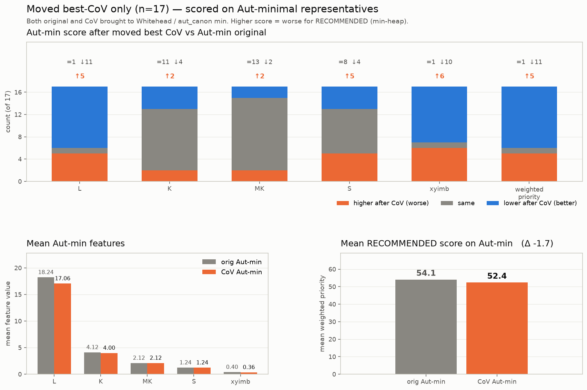

# Moved best-CoV scored on Aut-minimal representatives

Of the 60 shipped best-CoV starts, **17 are moved** (not Aut-relabels). For each, both the original and the CoV pair are reduced with Whitehead / `aut_canon`, then scored with RECOMMENDED features. Relabels are omitted — after Aut-min they are the same orbit.

```text
prio = L + 2.53·K + 6.418·MK + 8.458·S + 3.292·xyimb   # lower better
```



## Counts on Aut-min (of 17)

| feature | higher (worse) | same | lower (better) | mean Δ |
|---|---:|---:|---:|---:|
| L | 5 | 1 | 11 | -1.176 |
| K | 2 | 11 | 4 | -0.118 |
| MK | 2 | 13 | 2 | +0.000 |
| S | 5 | 8 | 4 | -0.009 |
| xyimb | 6 | 1 | 10 | -0.039 |
| prio | 5 | 1 | 11 | -1.678 |

## Raw strings vs Aut-min (weighted priority)

| view | higher (worse) | lower (better) | mean Δprio |
|---|---:|---:|---:|
| raw CoV string vs raw original | 11/17 | 6/17 | +14.15 |
| Aut-min CoV vs Aut-min original | 5/17 | 11/17 | -1.68 |

## Per-row Aut-min snapshot

| pres | μ_orig | μ_cov | ΔL | ΔK | ΔMK | Δprio_raw | Δprio_autmin |
|---|---:|---:|---:|---:|---:|---:|---:|
| ms48 | 12 | 11 | -1 | +0 | +0 | -1.2 | -1.2 |
| ms77 | 13 | 11 | -2 | -1 | -1 | +1.2 | -10.5 |
| ms141 | 13 | 12 | -1 | -1 | -1 | +2.3 | -9.2 |
| ms203 | 12 | 15 | +3 | +0 | +0 | +4.5 | +3.5 |
| ms217 | 14 | 12 | -2 | +0 | +0 | -2.4 | -2.4 |
| ms228 | 14 | 8 | -6 | -2 | +0 | -5.9 | -13.3 |
| ms380 | 17 | 14 | -3 | +0 | +0 | -3.4 | -3.4 |
| ms455 | 19 | 12 | -7 | -2 | +0 | -10.4 | -14.1 |
| ms505 | 22 | 19 | -3 | +0 | +0 | +81.9 | -1.5 |
| ms549 | 18 | 16 | -2 | +0 | +0 | -1.1 | -2.2 |
| ms609 | 22 | 22 | +0 | +0 | +0 | +3.2 | +0.0 |
| ms623 | 22 | 23 | +1 | +2 | +1 | +1.2 | +10.1 |
| ms624 | 22 | 23 | +1 | +2 | +1 | +3.3 | +10.1 |
| ms634 | 23 | 19 | -4 | +0 | +0 | +76.5 | -2.5 |
| ms635 | 23 | 19 | -4 | +0 | +0 | +72.3 | -2.5 |
| ms637 | 22 | 27 | +5 | +0 | +0 | +9.3 | +5.3 |
| ms639 | 22 | 27 | +5 | +0 | +0 | +9.3 | +5.3 |

## Source

- Input: [`cov_heur_b1k_subset60.csv`](cov_heur_b1k_subset60.csv) (moved rows only)
- Table: [`cov_autmin_feature_delta_moved.csv`](cov_autmin_feature_delta_moved.csv)
- Runner: `experiments/heuristic_search/runners/cov_autmin_feature_delta.py`
