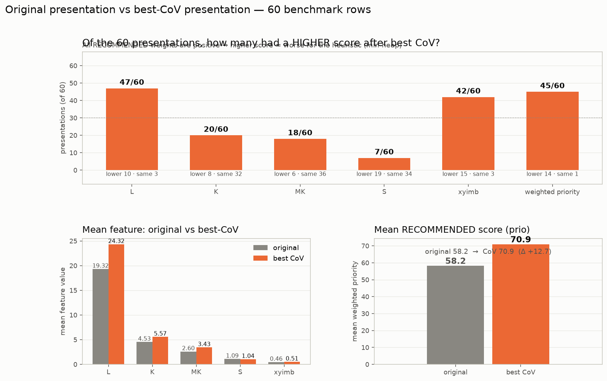
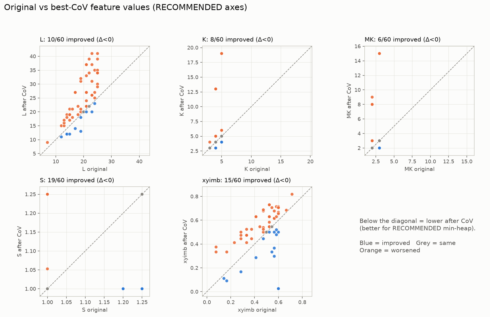
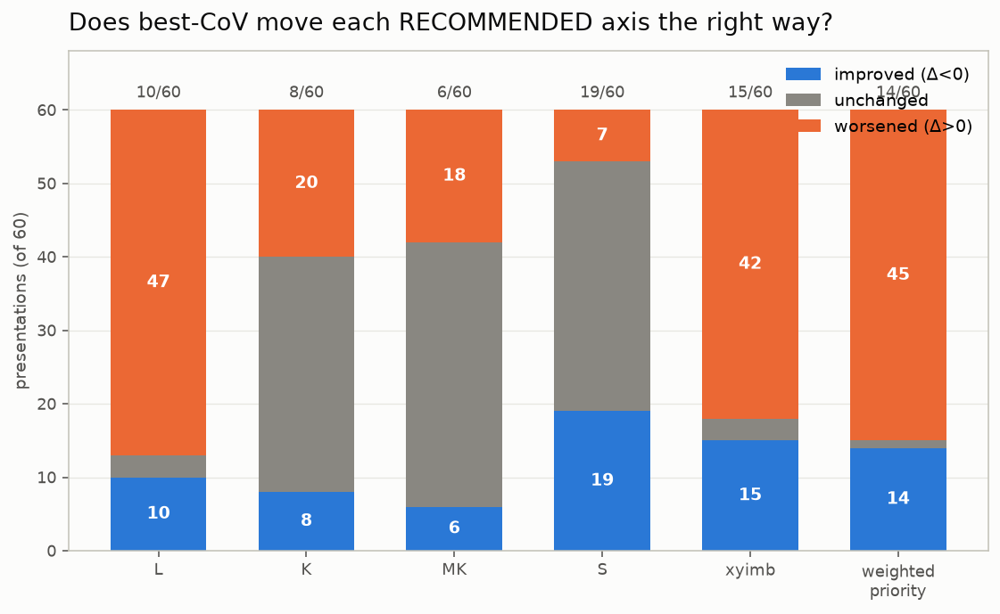
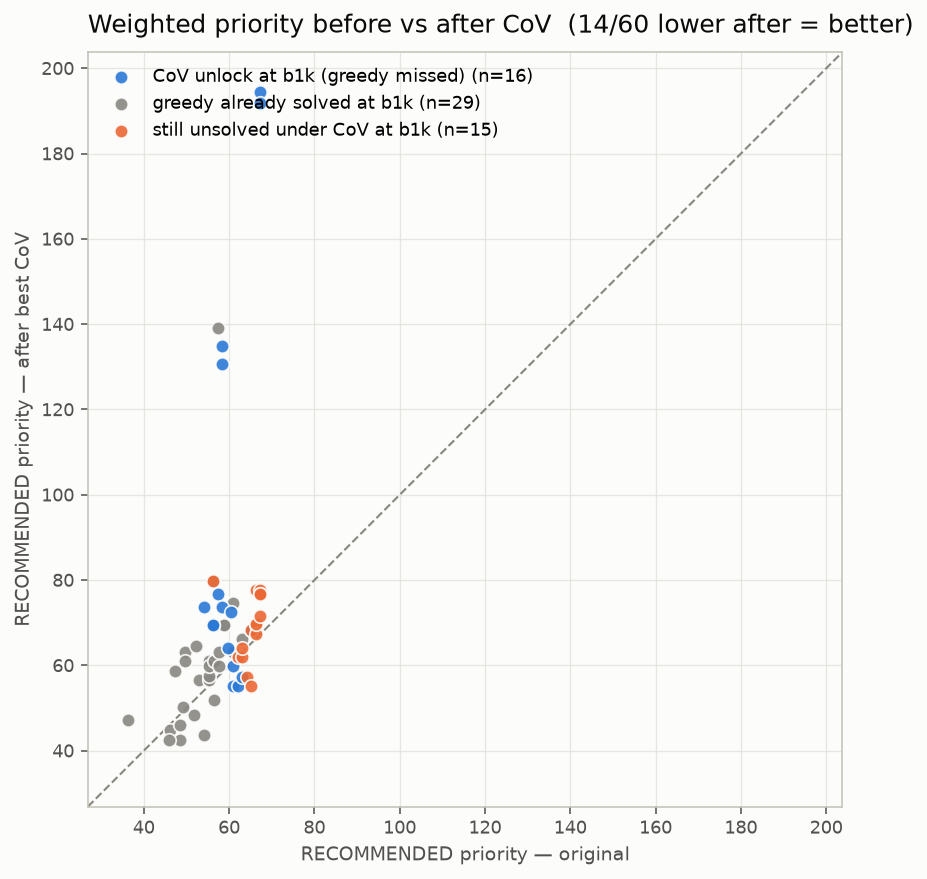

# CoV vs RECOMMENDED feature alignment

Diagnostic only: for each of the 60 benchmark presentations, score the original pair and its oracle best-CoV transform with the five features in `RECOMMENDED`, then ask whether CoV moves those features the way the heuristic prefers. **No search** — only `phi` on the two starts.

## Interpretation

`RECOMMENDED` is a min-heap priority

```text
prio = L + 2.53·K + 6.418·MK + 8.458·S + 3.292·xyimb
```

Lower is better. Every weight is positive, so **Δ < 0** on a feature (or on `prio`) is an improvement for the heuristic.

Caveat: the oracle `z` was selected by **length-only** cost at ≤20,000 nodes, not by RECOMMENDED. This checks feature *alignment*, not CoV selection under the tuned ordering.

## Headline

- **L**: 17% improved (10/60), unchanged 3, worsened 47; mean Δ = +5.000, median Δ = +4.000
- **K**: 13% improved (8/60), unchanged 32, worsened 20; mean Δ = +1.033, median Δ = +0.000
- **MK**: 10% improved (6/60), unchanged 36, worsened 18; mean Δ = +0.833, median Δ = +0.000
- **S**: 32% improved (19/60), unchanged 34, worsened 7; mean Δ = -0.052, median Δ = +0.000
- **xyimb**: 25% improved (15/60), unchanged 3, worsened 42; mean Δ = +0.045, median Δ = +0.068
- **weighted priority**: 23% improved (14/60), unchanged 1, worsened 45; mean Δ = +12.675, median Δ = +4.397

At budget 1,000 with length-only ordering, best-CoV unlocks **16** presentations that plain greedy misses (`b1k_covgreedy` vs `b1k_greedy`).

Priority drops on **14/60** rows and rises on **45/60** (same on 1).

Among rows where priority **falls**, 29% are CoV unlocks (4/14).
Among rows where priority **rises**, 27% are CoV unlocks (12/45).

## Simple picture

For each RECOMMENDED axis (and the weighted priority), count how many of the 60 presentations got a **higher** score after best CoV, and compare the **mean on the original** vs the **mean on the best-CoV** start. Higher = worse for the heuristic (all weights positive, min-heap).



## Verdict

**Best CoV does not win by improving the RECOMMENDED feature axes.** L rises on 47/60 rows; K and MK usually stay put or rise; xyimb worsens on 42/60; the weighted priority rises on 45/60 (mean Δprio ≈ +12.7). Only S tilts the helpful way more often than not (19 improved vs 7 worsened), and the effect is tiny.

Δprio also does **not** track CoV’s solve advantage: unlock rate is almost identical when priority falls (29%) and when it rises (27%). On the 16 rows CoV actually unlocks at b1k, mean Δprio is **worse** (+30) than on the rest (+6) — CoV helps despite looking worse to RECOMMENDED, not because of it.

## More figures







## Stratified means (CoV unlock vs not)

| feature | mean Δ when CoV helped | mean Δ otherwise |
|---|---:|---:|
| L | +7.438 | +4.114 |
| K | +3.062 | +0.295 |
| MK | +2.438 | +0.250 |
| S | -0.075 | -0.043 |
| xyimb | -0.043 | +0.077 |
| prio | +30.054 | +6.355 |

## Source

- Input: [`cov_heur_b1k_subset60.csv`](cov_heur_b1k_subset60.csv)
- Table: [`cov_feature_delta_subset60.csv`](cov_feature_delta_subset60.csv)
- Runner: `experiments/heuristic_search/runners/cov_feature_delta.py`
