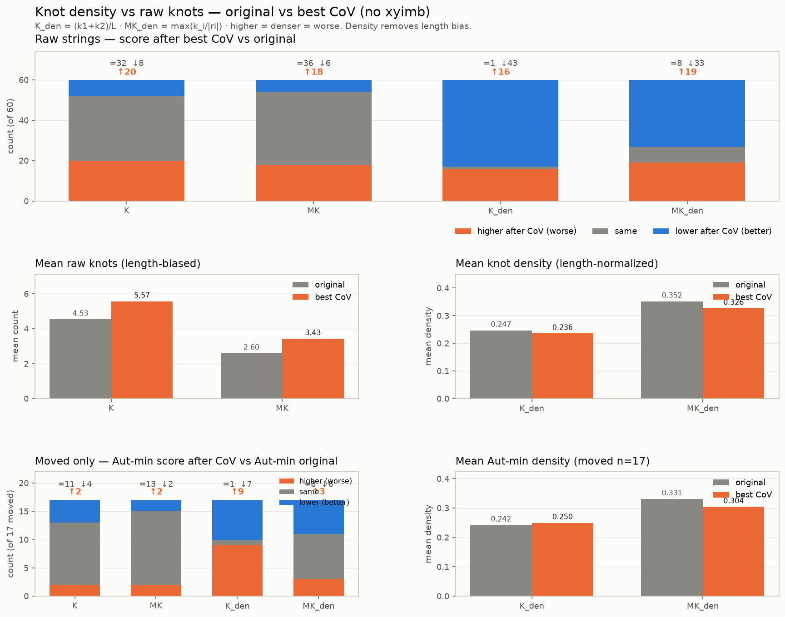

# Knot density vs best CoV (length-normalized, no xyimb)

Raw `K` / `MK` grow with length, so a lengthening CoV can look worse on knots even when knots are *sparser*. This check drops `xyimb` and compares densities:

```text
K_den  = (k1 + k2) / L
MK_den = max(k1/|r1|, k2/|r2|)
```

Higher density = denser knots = worse. `K` / `MK` are kept for contrast.



## Raw strings (all 60)

| metric | higher (worse) | same | lower (better) | mean orig | mean CoV | mean Δ |
|---|---:|---:|---:|---:|---:|---:|
| K | 20 | 32 | 8 | 4.533 | 5.567 | +1.033 |
| MK | 18 | 36 | 6 | 2.6 | 3.433 | +0.8333 |
| K_den | 16 | 1 | 43 | 0.2469 | 0.2357 | -0.01118 |
| MK_den | 19 | 8 | 33 | 0.3519 | 0.3264 | -0.02546 |
| L | 47 | 3 | 10 | 19.32 | 24.32 | +5 |
| S | 7 | 34 | 19 | 1.09 | 1.038 | -0.05162 |

## Aut-min (moved only, n=17)

| metric | higher (worse) | same | lower (better) | mean orig | mean CoV | mean Δ |
|---|---:|---:|---:|---:|---:|---:|
| K | 2 | 11 | 4 | 4.118 | 4 | -0.1176 |
| MK | 2 | 13 | 2 | 2.118 | 2.118 | +0 |
| K_den | 9 | 1 | 7 | 0.242 | 0.2497 | +0.007666 |
| MK_den | 3 | 8 | 6 | 0.3311 | 0.3041 | -0.02697 |
| L | 5 | 1 | 11 | 18.24 | 17.06 | -1.176 |
| S | 5 | 8 | 4 | 1.244 | 1.235 | -0.008824 |

## Verdict

**Raw strings (all 60):** density **flips** the knot story. Raw `K` / `MK` still rise after best CoV (`K` ↑20/=32/↓8, mean Δ +1.033; `MK` ↑18/=36/↓6, mean Δ +0.833), but `K_den` / `MK_den` more often **fall** (`K_den` ↑16/=1/↓43, mean Δ -0.0112; `MK_den` ↑19/=8/↓33, mean Δ -0.0255). So after removing length bias (and ignoring `xyimb`), best CoV does **not** look worse on knots — it looks slightly *sparser*.

**Aut-min moved (n=17):** density **neutralizes** rather than flips. `K_den` is higher on **9/17** and lower on **7/17** (mean Δ +0.0077); `MK_den` ↑3/=8/↓6 (mean Δ -0.0270). Relabel inflation is gone; the remaining knot-density signal is weak / mixed.

## Source

- Input: [`cov_heur_b1k_subset60.csv`](cov_heur_b1k_subset60.csv)
- Table: [`cov_knot_density_delta_subset60.csv`](cov_knot_density_delta_subset60.csv)
- Figure: [`figures/cov_knot_density_simple.png`](figures/cov_knot_density_simple.png)
- Runner: `experiments/heuristic_search/runners/cov_knot_density_delta.py`
