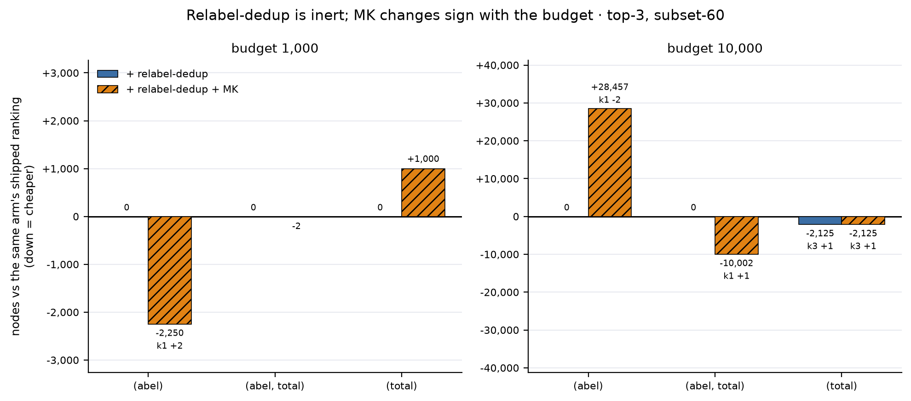

# Relabel-dedup, and `MK` at the last slot — both arms, budget 1,000 and 10,000

**Zero search nodes.** A re-ranking of the frozen `results/stable_ac/cov/covsweep_1000_66_subnc2pxysb_mrl24_cyc_s60r6_07_20_26.jsonl` and its 10,000-node twin through `abel_topk_cov_b1k`'s gated loader, subset-60, top 3. The sweep searched every candidate of every row, so unlike the ms640 top-3 census a promoted candidate costs nothing to score — this is the only place the dedup can be priced rather than merely counted.

## Budget 1,000

| arm | k=1 | k=3 | median nodes | mean nodes | deployed | wasted slots |
|---|---:|---:|---:|---:|---:|---:|
| `(abel)` | 38 | 41 | 18 | 165.6 | 63,790 | 72 |
| `(abel)` + relabel-dedup | 38 | 41 | 18 | 165.6 | 63,790 | 0 |
| `(abel)` + relabel-dedup + MK | 40 | 41 | 18 | 110.7 | 61,540 | 0 |
| `(abel, total)` | 40 | 41 | 18 | 112.9 | 61,627 | 83 |
| `(abel, total)` + relabel-dedup | 40 | 41 | 18 | 112.9 | 61,627 | 0 |
| `(abel, total)` + relabel-dedup + MK | 40 | 41 | 18 | 112.8 | 61,625 | 0 |
| `(total)` | 37 | 39 | 60 | 244.8 | 72,549 | 49 |
| `(total)` + relabel-dedup | 37 | 39 | 60 | 244.8 | 72,549 | 0 |
| `(total)` + relabel-dedup + MK | 37 | 39 | 60 | 270.5 | 73,549 | 0 |

## Budget 10,000

| arm | k=1 | k=3 | median nodes | mean nodes | deployed | wasted slots |
|---|---:|---:|---:|---:|---:|---:|
| `(abel)` | 52 | 52 | 35 | 1,103.3 | 297,372 | 72 |
| `(abel)` + relabel-dedup | 52 | 52 | 35 | 1,103.3 | 297,372 | 0 |
| `(abel)` + relabel-dedup + MK | 50 | 52 | 32 | 1,650.6 | 325,829 | 0 |
| `(abel, total)` | 51 | 52 | 32 | 1,231.3 | 304,030 | 83 |
| `(abel, total)` + relabel-dedup | 51 | 52 | 32 | 1,231.3 | 304,030 | 0 |
| `(abel, total)` + relabel-dedup + MK | 52 | 52 | 32 | 1,039.0 | 294,028 | 0 |
| `(total)` | 47 | 49 | 270 | 1,797.8 | 418,090 | 49 |
| `(total)` + relabel-dedup | 47 | 50 | 271 | 2,319.3 | 415,965 | 0 |
| `(total)` + relabel-dedup + MK | 47 | 50 | 271 | 2,319.3 | 415,965 | 0 |

## Paired, on the rows both arms solve

| base key | comparison | budget | win / tie / loss |
|---|---|---:|---|
| `(abel)` | dedup vs shipped | 1,000 | 0 / 41 / 0 |
| `(abel)` | dedup vs shipped | 10,000 | 0 / 52 / 0 |
| `(abel)` | MK vs name, after dedup | 1,000 | 7 / 34 / 0 |
| `(abel)` | MK vs name, after dedup | 10,000 | 8 / 39 / 5 |
| `(abel)` | both vs shipped | 1,000 | 7 / 34 / 0 |
| `(abel)` | both vs shipped | 10,000 | 8 / 39 / 5 |
| `(abel, total)` | dedup vs shipped | 1,000 | 0 / 41 / 0 |
| `(abel, total)` | dedup vs shipped | 10,000 | 0 / 52 / 0 |
| `(abel, total)` | MK vs name, after dedup | 1,000 | 1 / 40 / 0 |
| `(abel, total)` | MK vs name, after dedup | 10,000 | 2 / 50 / 0 |
| `(abel, total)` | both vs shipped | 1,000 | 1 / 40 / 0 |
| `(abel, total)` | both vs shipped | 10,000 | 2 / 50 / 0 |
| `(total)` | dedup vs shipped | 1,000 | 0 / 39 / 0 |
| `(total)` | dedup vs shipped | 10,000 | 0 / 49 / 0 |
| `(total)` | MK vs name, after dedup | 1,000 | 0 / 38 / 1 |
| `(total)` | MK vs name, after dedup | 10,000 | 0 / 50 / 0 |
| `(total)` | both vs shipped | 1,000 | 0 / 38 / 1 |
| `(total)` | both vs shipped | 10,000 | 0 / 49 / 0 |

## What the paired column can actually see

A win/tie/loss of 0/N/0 is only evidence if the metric had room to move. Two measurements say it mostly did not. **Every unsolved search burns the whole budget** — 0 of 6177 unsolved searches stop short of it — and the dedup **never changes rank 1** (it keeps the first-ranked member of each relabel class, so rank 1 is identical by construction). The deployed bill therefore cannot move on any row whose rank 1 already solves, which is nearly all of them. `promoted` below counts the rows whose top-3 *membership* the change actually rewrites; `sensitive` counts the rows where that rewrite could reach the bill at all.

| base key | budget | dedup rewrites top-3 | MK rewrites top-3 | rows the bill can see |
|---|---:|---:|---:|---:|
| `(abel)` | 1,000 | 51/60 | 22/60 | 3/60 |
| `(abel, total)` | 1,000 | 48/60 | 3/60 | 1/60 |
| `(total)` | 1,000 | 37/60 | 13/60 | 2/60 |
| `(abel)` | 10,000 | 51/60 | 22/60 | 0/60 |
| `(abel, total)` | 10,000 | 48/60 | 3/60 | 1/60 |
| `(total)` | 10,000 | 37/60 | 13/60 | 2/60 |

So the dedup's 0/N/0 is not "the dedup does nothing" — it rewrites five-sixths of the top-3 lists. It is "the bill cannot see ranks 2-3 except on a handful of rows." On `(abel)` at 10,000 that handful is **empty**, which makes the null there mathematically forced rather than measured, exactly the shape of [control-with-no-dynamic-range](../../experiments/lessons/control-with-no-dynamic-range.md). And `MK`'s support is thinner than its win column suggests: it rewrites the top-3 on 22/60 rows of `(abel)`, the arm where it *hurts* at 10,000, but only 3/60 of `(abel, total)`, the arm whose 1-2 wins are the whole case for keeping it.

## Which presentations, not how many

A count that does not move can still be a different set, and a figure keyed on the shipped arm would then depict a different `k` rows than the text describes. Set membership of the recommended `(abel, total)` + dedup + `MK` against the shipped `(abel)`:

| budget | k | shipped | recommended | identical set | gained | lost |
|---:|---:|---:|---:|---|---|---|
| 1,000 | 1 | 38 | 40 | no | 565, 575 | — |
| 1,000 | 3 | 41 | 41 | yes | — | — |
| 10,000 | 1 | 52 | 52 | yes | — | — |
| 10,000 | 3 | 52 | 52 | yes | — | — |

Reference points at budget 1,000: best-CoV **oracle 45/60**, plain greedy on the untransformed pair **29/60**. The solve column saturates against that oracle, so read the cost columns.

