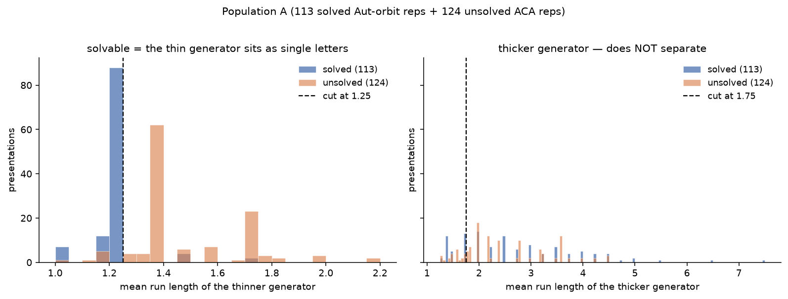

# Mean block histograms: min vs max (population A)

Same 237 states as the classic thinner-generator figure (113 solved Aut-orbit reps + 124 unsolved ACA-class reps).

| feature | AUC | solved mean | unsolved mean | best cut | bal. acc |
|---|---:|---:|---:|---:|---:|
| `min(mean_x, mean_y)` (thinner) | **0.912** | 1.247 | 1.506 | 1.25 | 0.945 |
| `max(mean_x, mean_y)` (thicker) | 0.469 | 2.704 | 2.481 | 1.75 | 0.549 |

## Verdict

- **Thinner (`min`)** separates cleanly — solved pile near 1.0–1.25, unsolved sit higher; the published cut at 1.25 still works.
- **Thicker (`max`) is not similar** — the two colors heavily overlap, AUC 0.469 (near chance / slightly inverted vs thinner's 0.912). Solved mean (2.70) is even a bit *higher* than unsolved (2.48).

## Source

- Runner: `experiments/clustering/plot_mean_block_hists.py`
- Figure: [`figures/mean_block_min_vs_max_hists.png`](figures/mean_block_min_vs_max_hists.png)
- Numbers: [`mean_block_min_vs_max.json`](mean_block_min_vs_max.json)
