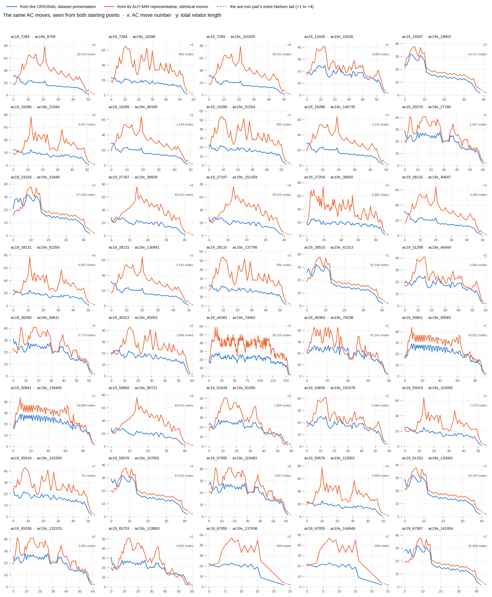

# Aut-minimising makes AC19 rows dramatically harder

Lucas Fagan asked whether the original of a hard AC19 presentation, before
aut-minimising, solves where its `Aut(F2)`-minimal representative does not.

**Yes, and by at least two to three orders of magnitude.**

| arm | originals | solved | representatives at 10M | ratio, median | ratio, worst row |
|---|---:|---:|---:|---:|---:|
| `greedy` | 40 | **40 / 40** | **0 / 28 solved** | **1,748x** | **191x** |
| `s20_mk2` | 18 | **18 / 18** | **0 / 9 solved** | **6,349x** | **977x** |

Every one of the 58 row-runs solved. **Not one needed 100,000 nodes** -- the
budget the cascade screen runs at -- against representatives that were given
**10,000,000** and exhausted every one.

### 58 is row-runs, not presentations

**The 18 `s20_mk2` originals are a strict subset of the 40 `greedy` originals**
-- set difference empty, checked from the derived lists, and pinned by
`tests/test_ac19_orig_10m.py::test_s20_mk2_originals_are_a_subset_of_greedy`.
The 9 `s20_mk2` orbits likewise sit inside the 28 `greedy` orbits.

So the target set is **28 distinct orbits and 40 distinct originals**, not 37
and 58. The 58 counts (arm x original) cells: 18 originals had BOTH arms run
on them, and both arms solved all 18. Any sentence of the form "all 58
presentations" overcounts distinct presentations by 18 and should say "all 58
row-runs" or "all 40 originals".

That overlap is not waste -- it is a paired head-to-head on 18 rows at equal
budget and cap, which no other part of this campaign has. It goes the
expected way on most of them and the other way on at least one, so it is a
distribution rather than a verdict:

| orbit | original | `greedy` | `s20_mk2` | cheaper |
|---|---|---:|---:|---|
| `ac19_16286` | `ac19x_140735` | 1,141 | 190 | s20_mk2 |
| `ac19_16286` | `ac19x_46185` | 1,148 | 192 | s20_mk2 |
| `ac19_16286` | `ac19x_51554` | 891 | 595 | s20_mk2 |
| `ac19_16286` | `ac19x_21044` | 6,467 | 1,575 | s20_mk2 |
| `ac19_28131` | `ac19x_137795` | 894 | 595 | s20_mk2 |
| `ac19_28131` | `ac19x_62350` | 6,002 | 1,575 | s20_mk2 |
| `ac19_28131` | `ac19x_40647` | 4,186 | 2,805 | s20_mk2 |
| `ac19_28131` | `ac19x_130941` | 4,193 | 2,807 | s20_mk2 |
| `ac19_7284` | `ac19x_16286` | 895 | 596 | s20_mk2 |
| `ac19_7284` | `ac19x_101025` | 28,012 | 10,227 | s20_mk2 |
| `ac19_7284` | `ac19x_8769` | 28,019 | 10,229 | s20_mk2 |
| `ac19_50841` | `ac19x_139445` | 50,800 | 958 | s20_mk2 |
| `ac19_50841` | `ac19x_90583` | 50,621 | 967 | s20_mk2 |
| `ac19_27254` | `ac19x_39050` | 6,605 | 1,190 | s20_mk2 |
| `ac19_59576` | `ac19x_115001` | 5,666 | 1,575 | s20_mk2 |
| `ac19_51034` | `ac19x_91095` | 1,839 | 2,638 | greedy |
| `ac19_65753` | `ac19x_133893` | 4,934 | 4,304 | s20_mk2 |
| `ac19_44381` | `ac19x_74462` | 36,225 | 6,522 | s20_mk2 |

All 18 rows, computed from the two jsonls. `s20_mk2` is cheaper on **17 of
18**; the one exception is `ac19x_91095`, where greedy's 1,839 beats 2,638.
On the same 18 originals: greedy median 5,300 and max 50,800, `s20_mk2`
median 1,575 and max 10,229.

| arm | min | p50 | p90 | max | sum | source |
|---|---:|---:|---:|---:|---:|---|
| `greedy` | 509 | 5,720 | 47,428 | 52,143 | 714,752 | **re-derived from the jsonl** |
| `s20_mk2` | 190 | 1,575 | 10,227 | 10,229 | 49,540 | **re-derived from the jsonl** |

`p90` is nearest-rank, `nodes[int(0.9 * n)]`. On 40 points that index is 36;
index 35 is 45,868, and both are defensible p90s. An earlier draft quoted
45,868. The same thing happened to the `s20_mk2` row: the cloud run's
terminal reported **6,522**, which is index 15 of the 18; the convention this
table uses gives index 16, **10,227**. Both are in the sorted list, one place
apart, and the table now uses one convention for both arms. Nothing is wrong with either number -- but quote the convention with
it, because a p90 that moves by 3% between two correct definitions is the
kind of cell that later reads as an error. `verify_ac19_orig_10m.py` prints
both neighbouring order statistics for exactly this reason.

Every other greedy cell -- min, p50, max, sum, and all 40 solve counts --
re-derives from the records exactly.

0 errors, 0 OOM. The box peaked at **14 GiB of 743**, and the campaign that
was sized for 6.5 hours finished in **6 minutes**, because every row solved
and nothing ran to exhaustion.

## The representatives carry a certificate too: the original's path, transported

Avi asked whether the original's path can be applied to the representative
it came from. It can, and it settles all 28 with an explicit certificate each.

### The theorem

`aut_canon(original)` ships the automorphism `phi` with
`canon_pair(phi(original)) == representative`.

> **Equivariance.** Let `phi` be an automorphism of `F2`. If a presentation `P`
> reaches the trivial presentation in `n` AC moves, then `phi(P)` reaches it in
> `n + k` moves, for a small explicit `k`.

Every AC move is one of three things: invert a relator, swap the two relators,
or replace `r_i` by `r_i . c^-1 r_j^s c` for a word `c` and a sign `s`. Only the
third carries any data, and it takes one line, because `phi` is a homomorphism:

    phi( r_i . c^-1 . r_j^s . c )  =  phi(r_i) . phi(c)^-1 . phi(r_j)^s . phi(c)

The right-hand side is **the same move** applied to `(phi(r1), phi(r2))`, with
the conjugator word `c` replaced by `phi(c)`. Inversion and swap carry no
conjugator and commute with `phi` for free. So applying `phi` to every state of
a solving path yields another valid AC path. That is the whole argument, and it
runs in both directions, since `phi^-1` is an automorphism too: the original and
its representative are AC-trivial together or not at all.

This is exactly the invariance the **whole 72,779-orbit screen already assumes**
-- collapsing 156,762 presentations to their `Aut(F2)` orbits is only legitimate
because AC-triviality is constant on an orbit. What is new here is that it is
**constructive**: not "both or neither", but an actual move list for the
representative, which a verifier replays.

**What transports and what does not.** The move type, the target relator and the
sign are unchanged. The conjugator word becomes `phi(c)`. The engine's
`(target, jsign, k1, k2)` encoding does NOT transport -- `k1`/`k2` are rotation
offsets into the current relators, and an offset is meaningless once a basis
change has rewritten the words. That is why `ac_decode.to_conjugator` converts a
stored move to its conjugator word first, and why the transport is written
against words rather than offsets.

**Why there is a tail at all.** The original's path stops at a terminal pair,
say `(Y, X)`. Push that through `phi` and you get something like `(X, YXX)`:
still a **basis** of `F2`, because an automorphism carries a generating pair to
a generating pair, but no longer two single letters. Nielsen's theorem reduces
any basis to `(x, y)` by invert, swap and multiply, each of which is itself an
AC move; `ac_decode.reduce_basis` finds the shortest such tail. It is never
empty and never long:

| tail length | 1 | 2 | 3 | 4 |
|---|---:|---:|---:|---:|
| certificates (of 58) | 5 | 17 | 19 | 17 |

**Verified per step, not just at the endpoint.** For every move of every path,
the translated move applied to `phi` of the state reproduces `phi` of the next
state:

| | steps | equivariant |
|---|---:|---:|
| `greedy`, 40 paths | 2,211 | **2,211** |
| `s20_mk2`, 18 paths | 1,069 | **1,069** |

`tests/test_transport_ac19_orig.py::test_every_step_is_equivariant` pins this.
The check must apply the move **in the pair's own order without canonicalizing
between steps**: canonicalizing mid-check can swap the two relators, after which
the move's target points at the wrong one and a correct transport reads as a
failure. Beyond that, every certificate was replayed end to end from the
representative's own words to `(x, y)` by `replay_elementary`, which trusts
nothing above it.

A single row is walked move by move, with both pairs printed at every step, in
[`WORKED_EXAMPLE.md`](WORKED_EXAMPLE.md). It also carries the mechanism behind
the cost: `phi` is a change of coordinates chosen to make **one point** short,
the starting pair, and it inflates every other point on the route. On the
example row `phi` sends a single `y` to `YXX`, so the last seven moves strip a
three-letter block on the aut-min side where the original strips one letter.
Over all 40: aut-minimising shortens the start on 34 rows and raises the peak
length on **40 of 40**, median 29 to 49. Since the arms are best-first on
length and the count of words grows like `3^n`, that higher ridge is the
search cost.

### The picture

One panel per original, `x` the AC move number and `y` the total relator length.
The two curves in a panel are **the same sequence of moves**: blue starting from
the raw dataset presentation, orange starting from its aut-min representative.
They run move for move to the blue curve's terminal, and the dashed orange stub
is the Nielsen tail. What the panels show is that the identical route is a much
harder climb from the aut-min side -- the representative starts shorter and is
driven far higher in total length on the way -- which is the same fact the node
counts report, in the geometry rather than in the search.

| | greedy | `s20_mk2` |
|---|---:|---:|
| originals transported | 40 / 40 | 18 / 18 |
| replayed from the representative to `(x, y)` | 40 | 18 |
| Nielsen tail, moves | 1-4 | 1-4 |

So **`rep_moves = original path_length + tail`**, in the same units as every
`path_length` in the campaign (one engine move is one conjugated
multiplication). Over the 28 representatives, taking the shortest
certificate any original on either arm gives:

| min | median | max | tail |
|---:|---:|---:|---|
| 25 | 56 | 137 | 1 to 4 moves on every one |

Per representative (`elementary` is the generator-level count of the
replayed form -- invert, swap, conjugate by one letter, multiply):

| orbit | representative | via original | arm | original moves | + tail | = rep moves | elementary |
|---|---|---|---|---:|---:|---:|---:|
| `ac19_7284` | `(YYXXXyXX, YXyxYXXXyxx)` | `ac19x_16286` | `s20_mk2` | 43 | 4 | **47** | 5,735 |
| `ac19_12445` | `(YYXXYx, YYYxyyxyXyX)` | `ac19x_15526` | `greedy` | 56 | 2 | **58** | 3,115 |
| `ac19_15507` | `(YYXXyxx, YYYYYYXYxYYYYX)` | `ac19x_19903` | `greedy` | 38 | 3 | **41** | 1,780 |
| `ac19_16286` | `(YYXXXXyx, YYXXXYXXyXX)` | `ac19x_51554` | `s20_mk2` | 41 | 3 | **44** | 4,580 |
| `ac19_20270` | `(YYXXXYxx, YYYXXXyxyyxyx)` | `ac19x_27180` | `greedy` | 60 | 2 | **62** | 3,753 |
| `ac19_23156` | `(YYXXyxx, YYYxYXYYX)` | `ac19x_31848` | `greedy` | 43 | 3 | **46** | 2,015 |
| `ac19_27187` | `(YYXXXXyXX, YYXXyxxxxxxyXXX)` | `ac19x_151459` | `greedy` | 39 | 4 | **43** | 4,013 |
| `ac19_27254` | `(YXXXyXYx, YXXyxxxxyxx)` | `ac19x_39050` | `s20_mk2` | 83 | 4 | **87** | 8,100 |
| `ac19_28131` | `(YYXXXXyx, YXXyXXXYx)` | `ac19x_137795` | `s20_mk2` | 42 | 3 | **45** | 4,647 |
| `ac19_28510` | `(YYXXyxx, YYYYYYXYXYYx)` | `ac19x_41313` | `greedy` | 40 | 3 | **43** | 1,896 |
| `ac19_31298` | `(YYXXYx, YYYXYYxYXyX)` | `ac19x_46444` | `greedy` | 58 | 2 | **60** | 3,209 |
| `ac19_36350` | `(YYXXXYxx, YYYYXXXyxyxYYYX)` | `ac19x_56611` | `greedy` | 62 | 2 | **64** | 3,926 |
| `ac19_40312` | `(YXXXXyXyx, YXXYxxxyxx)` | `ac19x_65053` | `greedy` | 58 | 2 | **60** | 3,778 |
| `ac19_44381` | `(YXXYXXyxx, YXyXyxxxxx)` | `ac19x_74462` | `s20_mk2` | 135 | 2 | **137** | 13,961 |
| `ac19_46363` | `(YXXXyXyxxx, YYYXYxYxxxx)` | `ac19x_79238` | `greedy` | 78 | 1 | **79** | 4,596 |
| `ac19_50841` | `(YXXyXyxx, YYYxxxYYx)` | `ac19x_139445` | `s20_mk2` | 90 | 1 | **91** | 5,970 |
| `ac19_50892` | `(YYXXXXyXX, YXXyXXYxxxxxxyX)` | `ac19x_90721` | `greedy` | 40 | 4 | **44** | 4,216 |
| `ac19_51034` | `(YYXXXXYX, YYYXYXyyX)` | `ac19x_91095` | `greedy` | 57 | 2 | **59** | 4,686 |
| `ac19_54835` | `(YYXXYx, YYYXYxxyXyX)` | `ac19x_101578` | `greedy` | 57 | 2 | **59** | 3,167 |
| `ac19_55019` | `(YXXXXyxYx, YXXYXXyXYxYXXX)` | `ac19x_143359` | `greedy` | 52 | 2 | **54** | 3,383 |
| `ac19_56970` | `(YYXXyxx, YYYYXXYxYYxYx)` | `ac19x_107601` | `greedy` | 41 | 3 | **44** | 1,929 |
| `ac19_57992` | `(YYXXXYxx, YYYXYYXXyyxyx)` | `ac19x_110483` | `greedy` | 61 | 2 | **63** | 3,831 |
| `ac19_59576` | `(YYXXXXyx, YXyxxxYXXyx)` | `ac19x_115001` | `s20_mk2` | 45 | 4 | **49** | 4,093 |
| `ac19_61253` | `(YYXXyxx, YYYYYYXYXYxxYYX)` | `ac19x_120061` | `greedy` | 39 | 3 | **42** | 1,857 |
| `ac19_65206` | `(YYXXXYxx, YYXYYxxyXYX)` | `ac19x_132233` | `greedy` | 59 | 2 | **61** | 3,692 |
| `ac19_65753` | `(YXXYxYxxx, YYYYXyXyxxx)` | `ac19x_133893` | `greedy` | 58 | 2 | **60** | 4,754 |
| `ac19_67055` | `(YYXXXyx, YXyxxxxxyXyxx)` | `ac19x_137936` | `greedy` | 23 | 2 | **25** | 1,678 |
| `ac19_67987` | `(YYXXyxx, YYXXYYxYYxYx)` | `ac19x_141054` | `greedy` | 42 | 3 | **45** | 1,970 |

Every original of every orbit has its own transported certificate in
`ac19_orig_10m_transported_greedy.jsonl` (40 rows) and
`ac19_orig_10m_transported_s20_mk2.jsonl` (18 rows): the representative,
`phi`, the three lengths, and the packed elementary certificate
(`decode_ac_jsonl` encoding). `transport_ac19_orig.py` regenerates them;
`tests/test_transport_ac19_orig.py` replays every shipped certificate.

What this does and does not say. It is a **certificate**, not a search
result: the representative was never *found* to be trivial by a search at
10,000,000 nodes, and still is not. It was already known AC-trivial (the
cascade or `s20_mk2` at another rung, see below); what is new is a path of
stated length starting from the representative's own words, obtained for
free from the original's. A path length of 44 is an upper bound on the
representative's AC distance, not the search's cost.
## Why the ratios are a lower bound

The numerator is censored. No representative solved at 10,000,000, so the
true cost of the minimised form is unknown and larger -- 10M is where the
search was stopped, not where it would have finished.

The denominator is exact: these are real solves carrying replayable
certificates.

## The join that makes the bound honest

A ratio against "10M" is only fair if every representative really was
exhausted **by the same arm at the same cap**. Checked row by row against
`../ac19_10m/`, and it holds without exception:

| arm | originals | orbits | every representative exhausted at exactly 10,000,000 nodes, cap 64 |
|---|---:|---:|---|
| `greedy` | 40 | 28 | yes |
| `s20_mk2` | 18 | 9 | yes |

No representative was merely un-run, none solved, none stopped early, and
none ran at a different cap. `tests/test_ac19_orig_10m.py` re-derives the row
lists from those same jsonls, so the two sides cannot drift apart.

## It is not length, and it is not the arm

**Not length.** Every original is as long as its representative or longer --
17 to 32 total against at most 24. The shorter word is the harder one, which
is the opposite of what a length-ordered search should prefer.

**Not the arm.** Both arms show it, and `s20_mk2` -- the stronger of the two
-- shows the *larger* effect: 6,349x median against greedy's 1,748x.

**Not a normalisation artifact.** The experiment is void if the arm
normalises its own input, so that is pinned by a test: no `aut_canon`,
`reduce_basis`, `basis_moves` or `canon_pair` appears anywhere in
`greedy_compact.py`, `greedy_baseline.py`, `run_leftovers_5m.py` or
`experiments/heuristic_search/core/`. The original and the representative
really are different starting points.

## Corroboration at a different budget and a different arm

The cascade shows the same thing on a disjoint set. Its own 8 open
representatives, at budget 100,000 with `--starter-budget 10000`, cap 255:
**8 of 8 originals solve at 12,641-13,352 nodes, 0 of 8 representatives
solve.** See [`../ac19_orig_cascade/RESULTS.md`](../ac19_orig_cascade/RESULTS.md).
Three arms, three budgets, three caps, same direction.

## What this does not show

- **No presentation changed AC status.** Every representative here was
  already settled -- 25 of the 28 by the cascade at under 4,275 nodes, the
  other 3 by `s20_mk2` at 1M. This is a search-difficulty result.
- **Nothing about aut-minimising in general**, only about these 28 orbits,
  which were selected precisely for being hard after minimisation. The
  selection is the point of the experiment and also its limit: it says
  minimisation *can* cost orders of magnitude, not how often it does.
- **Within-orbit variance is large -- as large as between orbits.** See the
  section below: one orbit's originals span 31x under greedy, so "the original
  of orbit X costs N" is not a well-formed sentence without saying which.

## Within-orbit variance

Where an orbit carries more than one original, the originals are the same
presentation up to `Aut(F2)` and the search treats them very differently.

`greedy`, the 7 of 28 orbits with more than one original:

| orbit | originals | nodes | spread |
|---|---:|---|---:|
| `ac19_67055` | 2 | 509, 569 | 1.1x |
| `ac19_55019` | 2 | 751, 7,278 | 9.7x |
| `ac19_16286` | 4 | 891, 1,141, 1,148, 6,467 | 7.3x |
| `ac19_28131` | 4 | 894, 4,186, 4,193, 6,002 | 6.7x |
| `ac19_7284` | 3 | 895, 28,012, 28,019 | 31.3x |
| `ac19_27187` | 2 | 40,420, 40,570 | 1.0x |
| `ac19_50841` | 2 | 50,621, 50,800 | 1.0x |

`s20_mk2`, the 4 of 9 orbits with more than one original:

| orbit | originals | nodes | spread |
|---|---:|---|---:|
| `ac19_16286` | 4 | 190, 192, 595, 1,575 | 8.3x |
| `ac19_28131` | 4 | 595, 1,575, 2,805, 2,807 | 4.7x |
| `ac19_7284` | 3 | 596, 10,227, 10,229 | 17.2x |
| `ac19_50841` | 2 | 958, 967 | 1.0x |

`ac19_7284` is the clearest case: three originals of one orbit at 895 and
~28,000 under greedy, 596 and ~10,200 under `s20_mk2`. The pair that costs
31x more on one arm costs 17x more on the other, so it is a property of the
words, not of the heuristic. Any per-orbit number must say which original.

## The `s20_mk2` records: run locally at 1,000,000, and why that is the same number

The greedy jsonl came off the 743 GB box. The `s20_mk2` jsonl never landed, so
it was re-run here on 2026-09-09 at a **1,000,000-node ceiling, cap 64** --
10,000,000 at cap 64 reserves 88 GB and this box has 15. The ceiling changes
no reported cost: a search at budget *B* is exactly the first *B* pops of a
longer one, and every one of the 18 solved at or below 10,229, so the 10M run
would have stopped at the identical pop on every row. Only an *unsolved* row
would read differently, and there are none.

The statistics quoted for this arm were transcribed from the cloud run's
terminal before its jsonl was lost. The local re-run reproduces the
order-independent four -- min 190, median 1,575, max 10,229, **sum 49,540** --
exactly, across a different machine, engine generation and ceiling; on 18
integers a matching sum, min, max and median pins the multiset. The p90
differs by one order statistic (6,522 vs 10,227), which is the convention
note above and not a data difference. That is the cross-generation
bit-identity property `ac19_autmin_10k` measured over 72,779 rows, here on 18,
and it is what licenses "re-derived" in the table.

The file carries `run_leftovers_1m`'s stem
(`leftovers_1m_s20_mk2_b1000000_mrl64.jsonl`) rather than the campaign's,
because that runner is the one that fits the box; the budget and cap in the
name are true.

## What the names mean

Three different indices appear in this directory, and reading one as another
gives the wrong presentation.

- **`ac19_<n>` is the n-th orbit, not a line.** The orbit list
  (`../ac19_autmin_screen/ac19_autmin_orbits.csv`) numbers its 72,779 rows
  0 to 72,778 in order of first appearance in `data/AC19_extended.txt`.
  `ac19_50892` is the 50,892nd orbit; its single member is dataset line
  90,721. Only `ac19_0` coincides with a line number. Pinned by
  `tests/test_ac19_autmin_screen_list.py::test_orbit_names_are_positions_not_dataset_lines`.
- **`ac19x_<n>` is line `n` of `data/AC19_extended.txt`, zero-based.** An
  editor counts that line as `n + 1`.
- **`data/AC19.txt` is a different file.** Its 140,535 rows are all contained
  in the extended file but in a different order, so it is not a prefix, and
  only 6 of the 40 originals occur in it by exact pair. Names here never
  refer to it.

The workbook `ac19_orig_10m_originals.xlsx` (one sheet, `greedy` only; CSV
twin `ac19_orig_10m_originals.csv` for git) is one row per original with nine
columns: the orbit and its aut-min pair, the original and its pair, the nodes
and path length greedy paid on the ORIGINAL, and `autmin_path_length` -- the
aut-min pair's own path length, from transporting that same certificate.
Built and checked by `make_ac19_orig_10m_xlsx.py --check`.

## Files

Run at sha `727914d2`, `ENGINE=hcompact`, campaign `ac19_orig_10m`, 5 workers,
budget 10,000,000, cap 64, paths captured.

    s3://acsolver-u124-205558941715/backup/orig10m/   2 jsonl + runA.log

In the repo, all under this directory:

| file | rows | what |
|---|---:|---|
| `ac19_orig_10m_greedy_b10000000_mrl64.jsonl` | 40 | greedy on the originals, cloud, 10M, with paths |
| `leftovers_1m_s20_mk2_b1000000_mrl64.jsonl` | 18 | `s20_mk2` on the originals, local, 1M (see above) |
| `leftovers_1m_s20_mk2_b1000000_mrl64_paths.jsonl` | 18 | the same 18 searches with `--track-path`: identical on every key but `seconds`, plus `path` and `path_moves` |
| `ac19_orig_10m_transported_{greedy,s20_mk2}.jsonl` | 40 + 18 | each original's certificate carried onto its representative, replayed |
| `ac19_orig_10m_originals.{xlsx,csv}` | 40 | the workbook and its git-diffable twin: original, aut-min form, greedy's cost, both path lengths |
| `ac19_orig_10m_transport_profiles.{svg,png}` | 40 panels | total relator length along the shared path, both starting points; `plot_ac19_orig_transport.py` |
| `WORKED_EXAMPLE.md` | 1 row | `ac19x_144949` move by move, both pairs at every step; `make_ac19_worked_example.py --check` |

`verify_ac19_orig_10m.py` re-derives every number above from these files and
replays all 58 certificates as elementary AC moves (`all checks pass`).

Reproduce:

    export ENGINE=hcompact
    PYTHONPATH=. python3 -m experiments.search.run_leftovers_5m \
        --arm greedy --campaign ac19_orig_10m \
        --out-dir results/heuristic_search/ac19_orig_10m --workers 5
